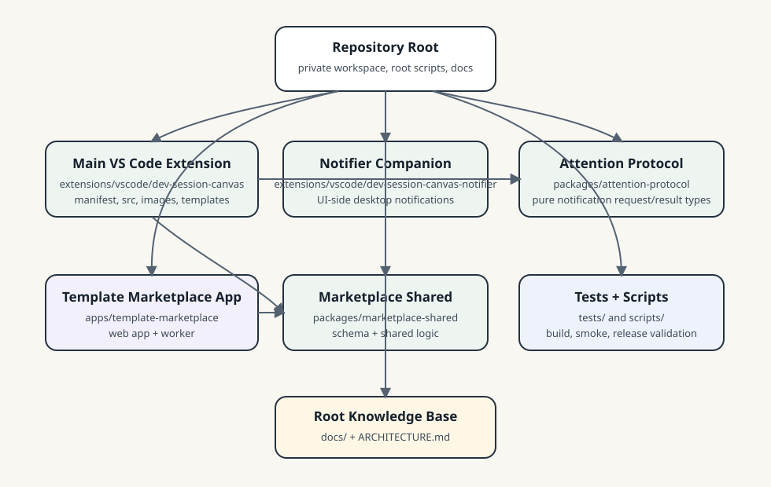

# DevSessionCanvas 架构地图

本文件提供仓库的顶层导航，重点回答四件事：

- 当前系统整体上是如何工作的。
- 重要代码分别放在哪里。
- 哪些边界属于架构不变量。
- 当你要改某类能力时，应该先从哪一层开始找。

本文件只记录当前已经成立的结构、边界和命名实体，不展开方案比较、细节时序或未定设计。此类内容进入 `docs/design-docs/` 与 `docs/exec-plans/`。

## 1. 鸟瞰视图（Bird's Eye View）

从最高层看，DevSessionCanvas 是一个运行在 VSCode 内的 workspace extension。它把一张无限 2D 画布放进 VSCode 的编辑区或 panel，并把 `agent | terminal | note` 三类节点投影到这张画布上。

系统当前由三个协同运行时组成：

- `Extension Host`：workspace 绑定画布状态与节点到会话映射的权威位置，负责命令、Webview 生命周期、workspace trust、持久化以及 Agent / Terminal 编排。
- `Webview`：负责画布渲染、节点交互、内嵌终端前端和局部 UI 状态。
- `Runtime Supervisor`：仅在 `live-runtime` 持久化模式下参与；负责在 VSCode 生命周期之外托管执行会话，并作为该会话 terminal event、revision、checkpoint 与 journal 的唯一运行时权威。

主路径可以概括为：

```text
用户命令 / 侧栏动作
  -> extensions/vscode/dev-session-canvas/src/extension.ts
  -> extensions/vscode/dev-session-canvas/src/panel/CanvasPanelManager.ts
  -> extensions/vscode/dev-session-canvas/src/common/protocol.ts 定义的消息与状态
  -> extensions/vscode/dev-session-canvas/src/webview/main.tsx 渲染画布与节点
  -> Webview 用户动作回传 Host
  -> Host 启停 Agent / Terminal、更新权威状态、按需持久化
  -> Host 再把最新状态广播回 Webview
```

执行型节点的路径在此基础上再多一层：

```text
CanvasPanelManager
  -> executionSessionBridge / agentCliResolver
  -> runtimeSupervisorClient（可选）
  -> runtimeSupervisorMain
  -> supervisor 按 authority + revision 持久化 output / resize / scrollback journal
  -> checkpoint + 连续 journal / live event 回流到 Host
  -> Host 校验、调度并投影到 Webview
```

这意味着当前项目不是“前端自己维护数据的 Web 白板”，也不是“独立桌面 app”。它的核心架构前提始终是：**VSCode 宿主掌握 workspace 绑定状态，Webview 负责呈现与交互；`live-runtime` 会话的进程与终端历史权威下沉到生命周期更长的 supervisor。**

## 2. 当前范围与非目标

当前顶层范围：

- 在 VSCode 内提供单一逻辑画布，支持 `editor` / `panel` 两种承载面。
- 在同一对象模型下支持 `agent`、`terminal`、`note` 三类节点。
- 让执行型节点具备真实运行、状态回传、基础恢复和 workspace 绑定持久化能力。
- 在 Trusted / Restricted、Local / Remote 场景下维持可解释的降级行为。

当前明确非目标：

- 独立于 VSCode 的桌面应用形态。
- 纯 web extension 或 `vscode.dev` 兼容作为当前主路径前提。
- 多人实时协作、CRDT 或远程共享白板。
- 在 `ARCHITECTURE.md` 中提前锁死具体 provider、UI 细节或临时实现策略。

## 3. 代码地图（Code Map）

### 仓库总览与 Monorepo 拓扑

主扩展迁入 `extensions/vscode/dev-session-canvas/` 后，仓库根目录只负责 workspace 编排、根级脚本和正式文档，不再兼任 VS Code extension manifest。当前代码包拓扑如下图；图只做导航，正式边界仍以本文正文为准。



当前最重要的运行时代码与验证目录可以先这样读：

```text
extensions/vscode/dev-session-canvas/
  package.json                  VS Code 主扩展 manifest 与局部脚本
  src/
    extension.ts                扩展入口
    common/                     跨边界共享模型、协议与纯工具
    panel/                      Extension Host 侧的画布编排与执行接线
    sidebar/                    VSCode Sidebar 只读投影
    supervisor/                 独立 runtime supervisor 进程
    webview/                    React / React Flow 画布前端
  resources/templates/          内置画布模板
  images/                       主扩展图标、Marketplace 媒体与 README 资产
  scripts/runtime/              打包后随扩展分发的运行时 hook
extensions/vscode/dev-session-canvas-notifier/
  src/                          UI-side notifier companion；负责本机桌面通知桥接
packages/
  attention-protocol/           主扩展与 notifier companion 之间的最小共享 attention 协议
  marketplace-shared/           模板市场共享 schema 与服务端 / 前端通用逻辑
apps/template-marketplace/      模板市场 Web 与 Worker 应用
tests/
  vscode-smoke/                 宿主级 smoke 与重开恢复验证
  playwright/                   Webview DOM 与交互回归
scripts/                        build、打包、smoke、调试入口
docs/                           根目录正式文档知识库
```


目录名和逻辑层不总是一一对应。尤其 `extensions/vscode/dev-session-canvas/src/panel/` 现在既包含 panel surface 相关代码，也承载了 Extension Host 侧的大部分运行时编排与执行基础设施；读代码时应按职责分层理解，不要被目录名误导。

### `extensions/vscode/dev-session-canvas/src/extension.ts`

这是扩展运行时入口。

关键命名实体：

- `activate` / `deactivate`
- `CanvasPanelManager`
- `CanvasSidebarView`
- `COMMAND_IDS` / `VIEW_IDS`

这里主要负责：

- 注册命令、树视图和 Webview provider。
- 创建单例 `CanvasPanelManager` 并把 sidebar 接到它的状态。
- 处理“打开画布”“创建节点”“重置画板”“清空画板”等顶层入口。

架构不变量：

- 这里是 VSCode 激活入口，不承载画布业务规则细节。
- 顶层命令应把具体状态变更委托给 `CanvasPanelManager`，而不是在入口处分叉维护状态。

### `extensions/vscode/dev-session-canvas/src/common/`

这是跨 `Extension Host`、`Webview`、`Supervisor` 的共享契约层，也是当前最稳定的 API boundary。

关键命名实体：

- `protocol.ts`
  - `CanvasNodeKind`
  - `CanvasNodeSummary`
  - `CanvasPrototypeState`
  - `WebviewToHostMessage`
  - `HostToWebviewMessage`
- `runtimeSupervisorProtocol.ts`
  - `RuntimeSupervisorSessionSnapshot`
  - `RuntimeSupervisorRequest` / `RuntimeSupervisorEvent`
- `serializedTerminalState.ts`
- `terminalSessionStream.ts`
- `terminalProjectionRefreshScheduler.ts`
- `runtimeSupervisorPaths.ts`
- `extensionStoragePaths.ts`
- `executionTerminalLinks.ts`
- `agentActivityHeuristics.ts`

这里主要负责：

- 定义节点模型、消息协议、终端快照格式、周期投影刷新调度和 supervisor 协议。
- 放置宿主与前端都会用到的纯逻辑和纯数据工具。
- 统一当前系统对“节点”“执行会话”“恢复快照”“终端链接”的命名。

架构不变量：

- `extensions/vscode/dev-session-canvas/src/common/` 不应依赖 `vscode`、React、DOM、`node-pty` 或具体 CLI provider。
- `protocol.ts` 与 `runtimeSupervisorProtocol.ts` 的变更默认是跨边界变更，必须同时检查 Host / Webview / Supervisor 三侧。
- workspace 绑定的权威状态可以由宿主持有，但它的可序列化表达必须能落在这里定义的共享模型上。

### `extensions/vscode/dev-session-canvas/src/panel/`

这是 Extension Host 侧的核心编排区。虽然目录名叫 `panel`，但它实际上承载的是“宿主里的画布与执行运行时中枢”。

关键命名实体：

- `CanvasPanelManager.ts`
  - 当前宿主权威状态中心
  - 管理 editor / panel 两种 surface
  - 处理节点创建、删除、移动、尺寸变更、持久化与恢复
- `getWebviewHtml.ts`
  - 生成 Webview HTML、资源 URI 与 CSP
- `configuration.ts`
  - 读取 VSCode 配置
- `agentCliResolver.ts`
  - 解析 `codex` / `claude` CLI 启动命令与来源
- `executionSessionBridge.ts`
  - 对 `node-pty` 的最小抽象
  - 定义 `ExecutionSessionProcess`
- `runtimeSupervisorClient.ts`
  - 宿主与 supervisor 的 socket 客户端
- `runtimeHostBackend.ts`
  - 选择 `systemd-user` 或 `legacy-detached` 后端，并负责启动 supervisor
- `executionTerminalNativeHelpers.ts`
  - 宿主侧文件路径、URL、拖拽资源与 VSCode 原生打开行为接线
- `executionTerminalLineContextTracker.ts`
  - 终端输出的行上下文追踪

这里主要负责：

- 持有宿主权威状态，并把它同步到一个或两个 Webview surface。
- 决定哪些状态进入 `workspaceState` / `storageUri`，哪些只留在 Webview 本地。
- 启动和停止 Agent / Terminal，校验并调度会话输出、同步节点状态、重连和协调 supervisor；Host 不为 `live-runtime` 补造 revision 或终端历史。
- 在 Webview xterm 真正完成终端操作后按 surface 校验 applied-revision，并把 panel/editor 两个消费水位分别转发给 supervisor。
- 对健康 authority session 的 Host 恢复缓存执行 capability-gated、确定性错峰的周期刷新；刷新失败或生命周期变化时保留旧健康缓存并清理 stale timer。
- 对 workspace trust、配置、恢复模式和远程宿主差异做最终裁决。

架构不变量：

- `CanvasPanelManager` 是当前 workspace 绑定画布状态的唯一权威入口；Webview 不应成为节点图和执行会话映射的唯一来源。
- `editor` 与 `panel` 只是同一逻辑画布的两种宿主承载面，而不是两套独立状态。
- `executionSessionBridge.ts` 是 `node-pty` 接入边界；其余层不应直接加载或控制 `node-pty`。
- `runtimeSupervisorClient.ts` 只通过协议与 socket 和 supervisor 通信，不应假设与 supervisor 共享内存或共享对象实例。
- trust、配置和恢复模式判断必须在宿主侧生效，不能只靠 Webview 隐藏按钮。

### `extensions/vscode/dev-session-canvas/src/sidebar/`

这是当前侧栏视图的只读投影层。

关键命名实体：

- `CanvasSidebarView`
- `CanvasSidebarState`

这里主要负责：

- 把当前画布状态投影成 VSCode Tree View。
- 提供“打开画布”“创建对象”“重置画板”“清空画板”等快捷入口。

架构不变量：

- 侧栏不维护独立业务状态；它只消费 `CanvasPanelManager` 派生出的 `CanvasSidebarState`。
- 任何画布真实状态都不应只存在于 sidebar 内部。

### `extensions/vscode/dev-session-canvas/src/webview/`

这是 React / React Flow 画布前端，也是用户可见的大部分交互所在。

关键命名实体：

- `main.tsx`
  - React 应用组合入口
  - 维护 App 状态机、主 React Flow 装配、选择、视口、消息边界、执行终端 controller 与测试 bridge
- `paneGallerySurface.tsx`
  - 多 workspace root 的 paneGallery root model helper 与 UI surface
  - 承载 paneGallery pane、thumbnail rail、controls 和内嵌 React Flow 渲染；状态、refs、viewport 保存和消息边界仍由 `main.tsx` 传入
- `fileNoteNodes.tsx`
  - `FileNode` / `FileListNode` / `NoteEditableNode` 渲染与 File/Note 专属局部 UI helper
  - 通过依赖注入复用 `canvasNodeChrome.tsx` 暴露的通用节点 chrome、resize affordance、handles、action button 和 fallback card
- `canvasNodeChrome.tsx`
  - 共享节点 chrome surface，包括 action button、React Flow handles、节点 resize affordance、overview title、compact fallback card 和 execution attention status
  - 不持有 Host/Webview 消息状态；由 `main.tsx` 注入本地化、状态文案、provider label 和最小 footprint helper
- `executionSessionNodes.tsx`
  - `AgentSessionNode` / `TerminalSessionNode` 渲染与节点内 xterm mount / resize / restore glue
  - 通过依赖注入复用 `main.tsx` 持有的执行终端 registry、controller factory、runtime context 与消息函数
- `executionTerminalTypes.ts`
  - Webview 执行终端 Host event、controller、registry entry 与 xterm 私有 mouse / selection 适配类型
- `executionTerminalNativeInteractions.ts`
  - `xterm.js` 在缩放、拖拽、选择和原生交互上的前端适配
- `canvasTypes.ts`
  - Webview 内部共享类型，包括 React Flow 节点 / 边 data、本地 UI 状态、paneGallery root model 与几何辅助类型
- `canvasEdges.tsx`
  - Canvas edge 几何、渲染、label 编辑、arrow / color toolbar 和 edge stroke 展示规则
- `canvasGraphRules.ts`
  - Webview 侧分组选择、模板兼容节点、workspace-root containment 和连线端点约束
- `canvasDomEvents.ts`
  - Webview 内共享的事件冒泡阻断与 IME composing 判断
- `paneGalleryLocalState.ts`
  - 多根窗格画廊的 Webview 本地布局模式、active root 与视口缓存规范化
- `noteMarkdownPreview.ts`
  - Note Markdown 阅读态渲染、source map DOM 标注、安全链接 / 图片规则和 checklist DOM helper
- `noteEditingSurface.ts`
  - Note 编辑态行号、scroll/source offset 同步、preview 双击定位和 Tab indent glue
- `canvasMiniMap.tsx`
  - Canvas minimap、spatial bounds、viewport helper 和 overview mode bridge
- `canvasUiSurface.tsx`
  - Webview UI 共享 surface，包括 overview inert context、标题编辑器、overflow 文本、编辑快捷键和选择/删除命中 helper
- `canvasGroupLayers.tsx`
  - Canvas group 背景/前景层、workspace root watermark、group frame chrome、分组命中排序与拖拽/缩放几何
- `canvasGroupFrameStyles.ts`
  - 分组框 chrome CSS 变量、workspace root watermark SVG pattern 和 workspace-root role 判断
- `styles.css`

这里主要负责：

- 渲染画布、节点、缩放与导航。
- 在节点内部承载富交互内容，包括标题编辑、Note 内容编辑和嵌入式终端前端；执行节点组件已收敛在 `executionSessionNodes.tsx`，入口只负责组合依赖。
- 维护局部 UI 状态，例如当前选中节点、视口位置、上下文菜单和短生命周期输入态。

架构不变量：

- Webview 不直接访问 VSCode API、文件系统或 CLI 进程；所有宿主能力都经消息边界进入。
- Webview 保存的是“局部 UI 状态”和“用户意图”，不是 workspace 绑定权威状态。
- 终端前端可以持有 `xterm.js` 实例，但实际进程生命周期、持久化和恢复策略由宿主决定。

### `extensions/vscode/dev-session-canvas-notifier/`

这是 UI-side notifier companion extension package。

关键命名实体：

- `extensions/vscode/dev-session-canvas-notifier/src/extension.ts`
- `extensions/vscode/dev-session-canvas-notifier/src/platformNotification.ts`

这里主要负责：

- 在本机 UI 侧接收结构化 attention notification 请求。
- 生成桌面通知点击后的 callback URI，并回调主扩展的内部受控回跳命令。
- 在测试模式下提供 notifier bridge 的宿主级 smoke 验证入口。

架构不变量：

- companion 只负责本机通知投递与点击回调，不持有画布权威状态。
- 主扩展是否设置 `attentionPending`、何时去重、何时清除 attention，仍由 `extensions/vscode/dev-session-canvas/` 中的主扩展裁决。

### `packages/attention-protocol/`

这是 notifier companion 当前最小共享协议包。

这里主要负责：

- 定义主扩展到 companion 的结构化 notification request / result。
- 提供通知点击回跳 action 的编码与解码辅助函数。

架构不变量：

- 它只承载纯数据协议与无副作用 helper，不依赖 `vscode`、React 或具体桌面通知命令。
- 当前只供 VS Code 主扩展和 notifier companion 复用，不承担跨 IDE 的通用协议治理。

### `extensions/vscode/dev-session-canvas/src/supervisor/`

这是 `live-runtime` 模式下的独立运行时监督进程。

关键命名实体：

- `runtimeSupervisorMain.ts`
  - supervisor server
  - 会话注册表、socket server、terminal revision、输出广播、空闲退出
- `terminalSessionJournal.ts`
  - 每会话完整分段 journal、checksum chain、原子 manifest 与崩溃尾部恢复
- `runtimeSupervisorLauncher.ts`

这里主要负责：

- 在宿主之外维持执行会话存活。
- 通过 `runtimeSupervisorProtocol.ts` 提供 create / attach / get snapshot / subscribe / applied-revision ACK / write / resize / scrollback / stop / delete 等请求。
- 为每个新会话分配稳定 authority，按同一连续 revision 记录 output、resize 与 scrollback。
- 完整保留分段 journal；checkpoint 只作为恢复加速缓存，不删除旧 journal segment。
- 以静态 checkpoint+journal 和延迟订阅的两阶段切点补齐 Host attach 间隙，再切换到 live event。
- 按 `socket + session + consumerId` 分别保存 panel/editor 的 applied-revision 水位；该水位不推进 authority revision，也不触发 journal compact。

架构不变量：

- supervisor 不依赖 `vscode` 或 Webview。
- supervisor 只知道执行会话和协议，不知道 React Flow 节点、侧栏结构或具体 UI 细节。
- `live-runtime` terminal revision 只能由 supervisor 在实际记录事件时推进；Host/Webview 只能验证和投影。
- 缺少 `terminalSessionStreamV1` capability 的旧 Supervisor 只能继续承载既有只读会话；Host 不向它发送新协议 RPC，不创建新会话，并在最后一个已知旧会话结束或最后一条旧 attach 引用失效后释放 client 等待 idle shutdown。
- journal 损坏或持久化失败必须 fail closed，不能用任意 raw tail 或净化 transcript 冒充可继续交互的终端状态。
- `live-runtime` 是执行持久化增强层，不是所有执行路径的前提；系统必须在没有 supervisor 的情况下仍可运行。

### `tests/` 与 `scripts/`

这两部分不是生产架构，但对理解系统如何被验证很重要。

关键命名实体：

- `tests/vscode-smoke/*.cjs`
- `tests/playwright/webview-harness.spec.mjs`
- `scripts/smoke/run-vscode-smoke.mjs`
- `scripts/test/run-playwright-webview.mjs`
- `scripts/build/build.mjs`

架构不变量：

- `tests/` 与 `scripts/` 是验证和开发工具，不是业务真相来源。
- 如果某条行为只在脚本里存在，而没有在 Host / Webview / Supervisor 正式边界中落地，通常说明架构还没收口。

## 4. 领域划分与当前映射

为保持和 `docs/design-docs/` 一致，当前顶层问题域仍使用以下命名：

- `VSCode 集成域`
  - `extensions/vscode/dev-session-canvas/src/extension.ts`
  - `extensions/vscode/dev-session-canvas/src/panel/CanvasPanelManager.ts`
  - `extensions/vscode/dev-session-canvas/src/sidebar/CanvasSidebarView.ts`
  - `extensions/vscode/dev-session-canvas/src/panel/getWebviewHtml.ts`
- `画布交互域`
  - `extensions/vscode/dev-session-canvas/src/webview/main.tsx`
  - `extensions/vscode/dev-session-canvas/src/webview/paneGallerySurface.tsx`
  - `extensions/vscode/dev-session-canvas/src/webview/fileNoteNodes.tsx`
  - `extensions/vscode/dev-session-canvas/src/webview/canvasNodeChrome.tsx`
  - `extensions/vscode/dev-session-canvas/src/webview/styles.css`
  - `extensions/vscode/dev-session-canvas/src/webview/executionTerminalNativeInteractions.ts`
- `协作对象域`
  - `extensions/vscode/dev-session-canvas/src/common/protocol.ts`
  - `CanvasNodeSummary` 及其 `agent / terminal / note` 元数据
- `执行编排域`
  - `extensions/vscode/dev-session-canvas/src/panel/executionSessionBridge.ts`
  - `extensions/vscode/dev-session-canvas/src/panel/runtimeSupervisorClient.ts`
  - `extensions/vscode/dev-session-canvas/src/panel/runtimeHostBackend.ts`
  - `extensions/vscode/dev-session-canvas/src/supervisor/runtimeSupervisorMain.ts`
  - `extensions/vscode/dev-session-canvas/src/panel/agentCliResolver.ts`
- `项目状态域`
  - `CanvasPrototypeState`
  - `serializedTerminalState.ts`
  - `extensionStoragePaths.ts`
  - `runtimeSupervisorPaths.ts`
  - `CanvasPanelManager` 内的持久化与恢复逻辑

这些域是理解问题的方式，不要求目录一一对应。一个目录可以跨多个域，一个域也可以分布在多个目录中。

## 5. 分层与依赖方向

当前更适合按逻辑边界理解系统，而不是按目录名理解：

- `宿主集成层`
  - `extensions/vscode/dev-session-canvas/src/extension.ts`
  - `extensions/vscode/dev-session-canvas/src/panel/CanvasPanelManager.ts`
  - `extensions/vscode/dev-session-canvas/src/sidebar/CanvasSidebarView.ts`
- `画布呈现层`
  - `extensions/vscode/dev-session-canvas/src/webview/*`
- `共享模型与编排层`
  - `extensions/vscode/dev-session-canvas/src/common/protocol.ts`
  - `extensions/vscode/dev-session-canvas/src/common/runtimeSupervisorProtocol.ts`
  - 其余 `extensions/vscode/dev-session-canvas/src/common/*` 共享纯模型与纯工具
- `适配与基础设施层`
  - `extensions/vscode/dev-session-canvas/src/panel/executionSessionBridge.ts`
  - `extensions/vscode/dev-session-canvas/src/panel/runtimeSupervisorClient.ts`
  - `extensions/vscode/dev-session-canvas/src/panel/runtimeHostBackend.ts`
  - `extensions/vscode/dev-session-canvas/src/supervisor/*`
  - 宿主侧路径、持久化与原生交互辅助

允许的依赖方向如下：

```text
宿主集成层 -> 共享模型与编排层
宿主集成层 -> 适配与基础设施层
画布呈现层 -> 共享模型与编排层
适配与基础设施层 -> 共享模型与编排层
宿主集成层 <-> 画布呈现层 仅通过消息协议通信
```

默认视为架构违例的方向：

- `extensions/vscode/dev-session-canvas/src/common/` 反向依赖 `vscode`、React、DOM 或 `node-pty`
- `extensions/vscode/dev-session-canvas/src/webview/` 直接操作文件系统、CLI 进程或宿主存储
- `extensions/vscode/dev-session-canvas/src/sidebar/` 维护独立业务状态
- UI 组件直接越过宿主协议去控制 supervisor 或执行进程

## 6. 当前最重要的架构不变量

### 6.1 状态权威边界

- workspace 绑定画布状态由宿主持有，当前中心在 `CanvasPanelManager`。
- `live-runtime` 会话的 terminal event 历史、authority 与 revision 由 Runtime Supervisor 持有；Host snapshot 只是缓存或投影，不是跨 Reload Window 的恢复事实。
- Webview 的 `setState()` / `getState()` 只负责局部 UI 恢复，不承担完整业务恢复。
- `CanvasPrototypeState` 与终端序列化快照必须能独立于具体 Webview 进程存在。

### 6.2 协议边界

- `Webview <-> Host` 与 `Host <-> Supervisor` 都是显式协议边界。
- 任何跨边界对象都应优先使用 `extensions/vscode/dev-session-canvas/src/common/` 中的可序列化类型表达。
- 协议一旦变化，默认需要同步消息发送方、接收方和对应测试。
- applied-revision 只在 xterm write callback 或保序 terminal control 操作完成后推进；它是消费证据，不是 authority revision 或 checkpoint 覆盖证明。

### 6.3 执行边界

- 真实执行进程通过 `ExecutionSessionProcess` 抽象接入。
- `agent` 和 `terminal` 都属于执行型节点，但 UI 呈现不同、生命周期规则不同。
- supervisor 负责“会话继续活着”以及 `live-runtime` 终端历史连续，宿主负责“把会话映射回画布对象并表达给用户”。

### 6.4 信任与安全边界

- workspace trust 会影响执行型能力是否可创建、启动或恢复。
- 配置中的 provider 命令、shell 路径和 runtime persistence 开关都属于宿主裁决范围。
- Webview 与 supervisor 都不应绕过宿主对 trust、路径和启动参数的约束。

### 6.5 表现层边界

- 画布节点的视觉表面、缩放、选择和编辑反馈属于 Webview。
- 节点模型、生命周期、恢复模式和持久化语义不由 React 组件定义。
- 同一个节点的“看起来怎样”与“它实际运行成什么状态”必须允许异步收敛，不能把 UI 局部状态误当成运行时真相。

## 7. 横切关注点（Cross-Cutting Concerns）

### 恢复与持久化

当前系统明确区分 `snapshot-only` 与 `live-runtime`。前者由 Host 维护状态快照与 UI 恢复；后者由 supervisor 额外维护跨 VSCode 生命周期的执行会话、完整 terminal journal 和 checkpoint cache。Reload Window 后的新 Host 必须重新 attach supervisor authority，不能用重建前 Host snapshot 推断离线期间的输出。Host 的 `terminalStream` 只是恢复缓存：新投影 attach 前和无 attach 的 10–12 秒错峰周期内可通过只读 snapshot RPC 收敛，并把 RPC 期间的连续 live tail 无损合并；任何失败都保留旧健康缓存，不能按大小丢弃事件。

### Remote / Local 拓扑

当前扩展是 `workspace` extension。远程工作区下，Extension Host 可以在远端，而 Webview 仍在本机或浏览器侧。任何依赖“前后端同机”的实现都需要先经过这个约束检查。

### 执行兼容性

`node-pty`、Electron ABI、`systemd --user`、shell 路径与平台兼容性都属于架构级关注点，不只是实现细节。相关改动默认需要同时检查宿主路径、supervisor 路径和 smoke 覆盖。

### 可观测性与验证

当前调试与验证链路依赖：

- Host 侧调试命令与 debug snapshot
- `tests/vscode-smoke/` 的宿主场景
- `tests/playwright/` 的 Webview 场景

这意味着“是否可验证”本身也是架构约束。新的关键边界如果没有对应的可观测入口，通常说明设计还不完整。

## 8. 当你要改某类问题时，先去哪里找

- 改命令注册、承载面打开方式、serializer、激活入口：
  - `extensions/vscode/dev-session-canvas/src/extension.ts`
  - `extensions/vscode/dev-session-canvas/src/panel/CanvasPanelManager.ts`
- 改节点模型、消息类型、状态字段、跨边界载荷：
  - `extensions/vscode/dev-session-canvas/src/common/protocol.ts`
  - `extensions/vscode/dev-session-canvas/src/common/runtimeSupervisorProtocol.ts`
  - `extensions/vscode/dev-session-canvas/src/common/terminalSessionStream.ts`
- 改画布 UI、节点交互、标题/内容编辑、缩放与聚焦：
  - `extensions/vscode/dev-session-canvas/src/webview/main.tsx`
  - `extensions/vscode/dev-session-canvas/src/webview/canvasNodeChrome.tsx`
  - `extensions/vscode/dev-session-canvas/src/webview/fileNoteNodes.tsx`
  - `extensions/vscode/dev-session-canvas/src/webview/styles.css`
- 改侧栏显示和快捷动作：
  - `extensions/vscode/dev-session-canvas/src/sidebar/CanvasSidebarView.ts`
- 改 Agent / Terminal 启动、停止、恢复、输出桥：
  - `extensions/vscode/dev-session-canvas/src/panel/executionSessionBridge.ts`
  - `extensions/vscode/dev-session-canvas/src/panel/runtimeSupervisorClient.ts`
  - `extensions/vscode/dev-session-canvas/src/supervisor/runtimeSupervisorMain.ts`
  - `extensions/vscode/dev-session-canvas/src/supervisor/terminalSessionJournal.ts`
- 改 CLI 解析、shell 路径、运行时后端选择：
  - `extensions/vscode/dev-session-canvas/src/panel/agentCliResolver.ts`
  - `extensions/vscode/dev-session-canvas/src/panel/runtimeHostBackend.ts`
  - `extensions/vscode/dev-session-canvas/src/panel/configuration.ts`
- 改持久化路径、storage slot、终端快照恢复：
  - `extensions/vscode/dev-session-canvas/src/common/extensionStoragePaths.ts`
  - `extensions/vscode/dev-session-canvas/src/common/runtimeSupervisorPaths.ts`
  - `extensions/vscode/dev-session-canvas/src/common/serializedTerminalState.ts`
  - `extensions/vscode/dev-session-canvas/src/panel/CanvasPanelManager.ts`
- 补验证或定位回归：
  - `tests/vscode-smoke/*.cjs`
  - `tests/playwright/webview-harness.spec.mjs`
  - `scripts/smoke/run-vscode-smoke.mjs`
  - `scripts/test/run-playwright-webview.mjs`
