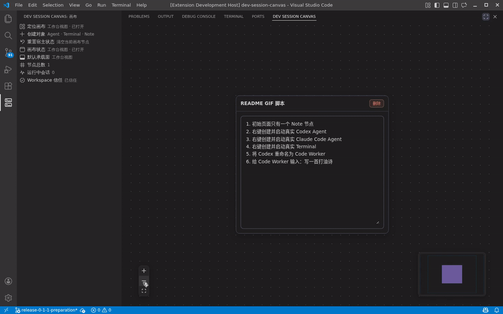

# DevSessionCanvas

[Chinese (default)](README.md) | English

DevSessionCanvas is a multi-session collaboration canvas extension for VS Code. It provides a shared canvas that gives `Agent` and `Terminal` sessions a global view, helping you manage multiple development execution sessions inside a single workspace.

The product has entered the public `Preview` phase. The repository's release assets and external messaging have largely been finalized, and the remaining work is focused on release-day publication and post-release verification. It is aimed at advanced users who accept early limitations and can prepare their local CLI runtime environment themselves.



## Who It Is For

- Developers who need to run multiple `Agent` or terminal sessions in parallel inside the same VS Code workspace
- Users who want a canvas-level global context instead of switching back and forth between terminal tabs
- Advanced users who are willing to use a `Preview` build and can prepare `codex` or `claude` CLI themselves

## What The Preview Includes

- A primary canvas that defaults to the `panel` route and can also be switched back to the editor area
- A minimal working path for `Agent` and `Terminal` nodes
- Lightweight `Note` nodes for supporting collaboration
- Basic canvas interaction and layout built on React Flow
- Limited capability handling under `Restricted Mode`
- A public `Preview` release path targeting the `Visual Studio Marketplace`

## What The Preview Does Not Include

- A stable-release guarantee
- `Virtual Workspace` support
- A zero-configuration out-of-the-box experience for all users
- A complete public support matrix across all three desktop platforms
- A full stable-release delivery process

## Runtime Requirements

- VS Code `1.85.0` or later
- A standard filesystem workspace, either on local disk or in a `Remote SSH` workspace
- The required CLI runtime:
  - `Agent` nodes depend on `codex` or `claude`
  - `Terminal` nodes depend on a local shell
- A trusted workspace
  - In an untrusted workspace, the canvas can still be opened, but execution entry points are disabled

## Project Status

The project has completed its first round of research, design, and MVP validation, and is now in the public `Preview` phase. The current focus is on platform compatibility, recovery-path verification, and continued iteration under Marketplace `Preview` messaging, rather than inventing a new release-preparation plan. The external version remains explicitly `Preview`, with no stable-release commitment.

Explicit conclusions:

- The current version is `Preview`, not a stable release.
- `Restricted Mode` is supported with limited capability messaging. Execution entry points such as `Agent` and `Terminal` are disabled in an untrusted workspace.
- `Virtual Workspace` is not supported. `vscode.dev`, GitHub Repositories, and other purely virtual filesystem windows are outside the release scope.
- The primary public distribution channel is now `Visual Studio Marketplace`. Whether to publish to `Open VSX` remains deferred.
- The product still depends on local CLI availability and workspace-extension runtime conditions, so it is better suited to advanced users who can prepare `codex` or `claude` CLI themselves.

Related entry points:

- Release playbook: [`docs/public-preview-release-playbook.md`](docs/public-preview-release-playbook.md)
- Public support boundaries: [`docs/support.md`](docs/support.md)
- Design conclusions and release judgment: [`docs/design-docs/public-marketplace-release-readiness.md`](docs/design-docs/public-marketplace-release-readiness.md)

## Preview Distribution

Public distribution is intended to happen through `Visual Studio Marketplace`. `.vsix` files are no longer treated as a public distribution format for ordinary users and are kept only as build artifacts and release-verification inputs.

- Public `Preview` users should install through Marketplace rather than by manually distributing a `.vsix`
- The release assets in this repository have already been consolidated, but before the actual listing goes live, the final git ref still needs to be locked, the release executed, and post-release verification completed
- `Open VSX` is not part of the initial `Preview` launch path

## Build From Source And Install For Development

For developers, the recommended path is to build from source and install through an Extension Development Host, rather than manually installing a `.vsix`.

Minimum workflow:

```bash
npm install
npm run build
```

Then in the repository window:

1. Open `Run and Debug`
2. Select `Run Dev Session Canvas`
3. Press `F5` to launch the `Extension Development Host`

For more complete instructions on source development, `Remote SSH` debugging, and automated verification, see [CONTRIBUTING.md](CONTRIBUTING.md).

## Known Limitations

- The product is still in `Preview` and should not be treated as a stable production tool.
- `Virtual Workspace` is not supported.
- The public `Preview` distribution path has been consolidated around `Visual Studio Marketplace`, but release-day publication still requires manual execution and review.
- Verification coverage is still concentrated on the `Remote SSH` path. Linux, macOS, and Windows local paths have not yet been strictly validated.
- If the machine does not have a usable `codex` or `claude` CLI, `Agent` nodes cannot provide the full experience.

## Support Matrix

| Scenario | Status | What Users Should Expect |
| --- | --- | --- |
| `Remote SSH` workspace | Primary `Preview` path | This path has the strongest verification coverage. Users can try the main canvas, `Agent`, `Terminal`, and recovery flows |
| Linux local workspace | Can be tried, not strictly validated | There is partial automation and implementation evidence, but it is not covered by a strict Preview support commitment |
| macOS local workspace | Can be tried, not strictly validated | The code path is wired up, but rigorous validation evidence is still missing |
| Windows local workspace | Can be tried, not strictly validated | The code path is wired up, but rigorous validation evidence is still missing |
| `Restricted Mode` | Limited support | The canvas can be opened and saved layouts can be viewed, but execution entry points such as `Agent` and `Terminal` are disabled |
| `Virtual Workspace` | Unsupported | Outside the Preview scope |

## Capability Boundaries

- `Agent` nodes require `codex` or `claude` CLI that can be resolved by the local or remote Extension Host
- `Terminal` nodes require a shell environment available on the workspace side
- `devSessionCanvas.runtimePersistence.enabled = false`: baseline capability only, with no promise that real processes continue across VS Code lifecycle boundaries
- `devSessionCanvas.runtimePersistence.enabled = true`: now has substantial automation and manual validation evidence, especially around the `Remote SSH` real-reopen path. The user-visible guarantee still depends on the backend and platform combination. On Linux local and `Remote SSH`, the extension prefers a stronger guarantee when `systemd --user` is available, and otherwise falls back automatically to `best-effort`

## Feedback And Contact

- Scope, required environment details, and support boundaries before filing an issue: [`docs/support.md`](docs/support.md)
- Bugs and feature feedback: <https://github.com/ZY-WANG-0304/dev-session-canvas/issues>
- Security issues: `wzy0304@outlook.com`
- Feishu discussion group:

  

## Development And Contribution

Development setup, local debugging, main-path verification, and commit conventions are documented in [CONTRIBUTING.md](CONTRIBUTING.md).

If you want to continue development, start with `docs/WORKFLOW.md`, `ARCHITECTURE.md`, and `docs/PRODUCT_SENSE.md`.

## Background And Motivation

The direct inspiration for this project came from [OpenCove](https://github.com/DeadWaveWave/opencove). Its approach of managing multiple development sessions on a single canvas was especially compelling. When several terminals are active at once, developers often have to jump back and forth between them just to understand the state and progress of each session.

This project started from the observation that day-to-day development already happens mostly inside VS Code, and that it would be valuable to bring a global multi-session view into that familiar editor workflow. At the time, there was no existing VS Code extension that felt close enough, so building one as an extension became the practical path.

The goal is not to recreate all of OpenCove inside VS Code. The point is to take inspiration from it, then narrow the product around the VS Code context: prioritize global visibility and management for `Agent` and `Terminal` sessions, work with the existing extension ecosystem, and improve the development experience for the AI era.
