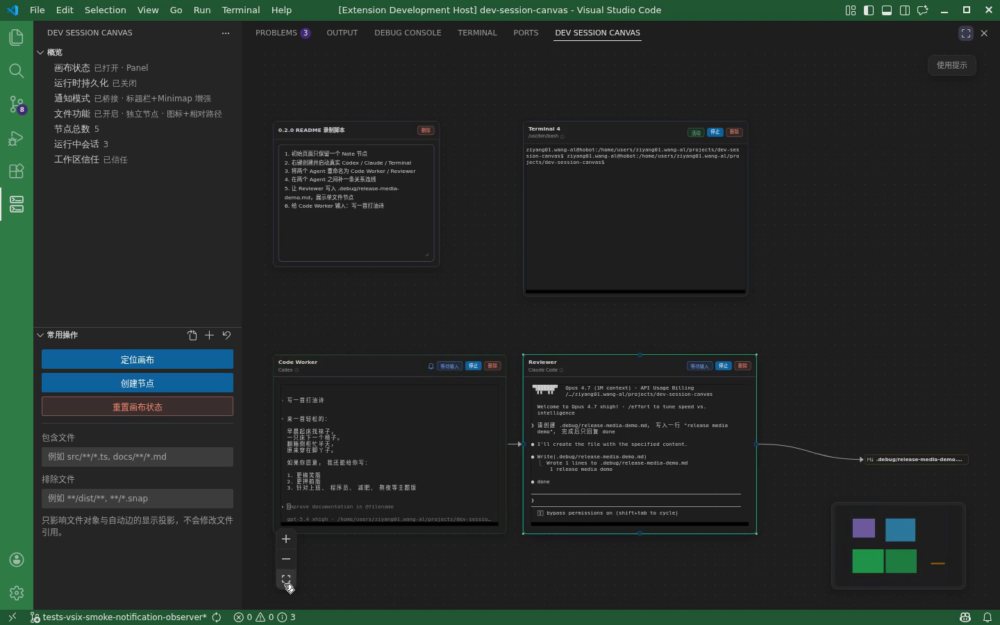

# Dev Session Canvas

<!-- dev-session-canvas-marketplace-readme -->

[Chinese (default)](README.marketplace.md) | English

Dev Session Canvas is a multi-agent AI workbench inside VS Code, and the canvas is its primary interaction surface. It lets you place `Agent`, `Terminal`, and `Note` nodes in the same view so you can manage multiple development execution sessions without bouncing between chat panels, terminal tabs, and editors. The extension is currently in public `Preview`.



<video src="images/marketplace/canvas-overview.mp4" controls muted loop playsinline></video>

## Product Positioning

- It should be described first as an `AI workbench with canvas`, not as a visualization tool with a thin AI layer
- `Visualization` is the interaction surface: the canvas carries execution objects and their global relationships
- `AI` is the primary usage context: multi-agent development workflows rather than a chat-first single-thread experience
- `Other` captures the workbench aspect: the product is designed to work with VS Code's native editors, terminals, and extension ecosystem

## Core Capabilities

- Open the main canvas in either the panel or the editor area
- Create `Agent`, `Terminal`, and `Note` nodes
- Drive `Agent` nodes through the `codex` or `claude` CLI
- Run `Terminal` nodes through the embedded terminal surface
- Keep canvas browsing available in `Restricted Mode` while automatically disabling execution entry points
- Provide stronger persistence guarantees through `runtimePersistence.enabled` when `systemd --user` is available on Linux local or `Remote SSH`, and otherwise fall back automatically to `best-effort`
- View sidebar `Nodes` and `Session History` lists to jump to current canvas nodes and restore a new `Agent` node from history

## Best Fit

- Trusted workspaces on a standard filesystem
- Environments where `codex` or `claude` CLI is already installed
- Developers who want to observe multiple development sessions without switching constantly between terminal tabs
- Users who want a canvas-shaped AI workbench rather than a single chat panel

## Support Scope And Limits

- The `Remote SSH` main path is validated and usable, and it remains the best-validated recommended environment
- Linux and macOS local workspaces now have functional validation for the `Preview` main path
- Windows local workspaces now have functional validation for the `Preview` main path, with one explicit known limitation: when using `Codex`, embedded session history still cannot page upward
- The sidebar `Session History` list only shows records that can be explicitly attributed to the current workspace; older sessions without working-directory metadata are skipped conservatively
- `Restricted Mode` allows the canvas to open, but disables execution entry points such as `Agent` and `Terminal`
- `Virtual Workspace` is not supported yet
- The extension is still in `Preview`, with no stable-release commitment

## Environment Requirements

- VS Code `1.85.0` or later
- A standard filesystem workspace
- `Agent` nodes require `codex` or `claude` CLI to be reachable from the Extension Host
- `Terminal` nodes require a shell available on the workspace side

## 0.4.1 Highlights

The public `0.4.1` release mainly delivers a round of UI fixes and interaction polish:

- Fix agent launch-presets and session-presentation details so `Default / Resume / YOLO / Sandbox` normalize more predictably against provider default arguments, avoiding conflicts between preset labels and the command that actually launches
- Polish node-creation and file-activity interactions so manually created nodes move smoothly into view; file activity stays disabled by default, and when explicitly enabled it gets more stable file-list tree behavior and automatic edge anchors
- Polish terminal-link behavior inside execution nodes by covering multiline path-and-line parsing, directory / word / search link behavior, and low-confidence hover / underline semantics
- Keep conservative workspace attribution for session history so only records that can be confirmed for the current workspace are shown, while still explicitly retaining the known Windows limitation where `Codex` history cannot page upward inside embedded sessions

## Installation And Upgrades

- The extension ID is `devsessioncanvas.dev-session-canvas`
- First-time installs and upgrades from `0.4.0` to `0.4.1` all go through the `Visual Studio Marketplace`; later `0.4.x` updates follow the same Marketplace upgrade path
- If your `0.2.0` workspace kept an older view-layout cache, the sidebar `Overview` and `Common Actions` views may appear as two separate icons for a while. That does not mean two extensions are installed. Move both views back into the same `Dev Session Canvas` container, or run `View: Reset View Locations`
- During Preview, cross-version workspace-state compatibility is not guaranteed. If a workspace contains important canvas state, back it up or validate in a non-critical environment before upgrading

## Usage Tips

### Unable to Create Terminal and Agent Nodes on Windows

**Symptom**: The workspace is trusted, but creating a node still shows only `Note`; `Terminal` and `Agent` node types are unexpectedly missing.

**Troubleshooting**: If this still happens in a trusted workspace, check the Windows PowerShell execution policy first. In some environments, the execution policy may interfere with Node.js-related commands.

**Suggested Fix**:

1. Open PowerShell as Administrator
2. Run the following command to set execution policy to `RemoteSigned`:
   ```powershell
   Set-ExecutionPolicy RemoteSigned
   ```
3. Type `Y` to confirm the change
4. Close and reopen VS Code
5. Try creating a `Terminal` or `Agent` node again to confirm whether the issue is resolved

## Rollback Guidance

- If the current version blocks your workflow, disable or uninstall the extension first
- Prefer waiting for the next `0.4.x` fix release rather than trying to downgrade manually
- If you must roll back, reinstall the target version and verify workspace state again. Compatibility between Preview versions is not guaranteed
- For support boundaries, issue reporting, and security guidance, use the links below

## Support And Feedback

- Preview support boundaries: <https://github.com/ZY-WANG-0304/dev-session-canvas/blob/main/docs/support.md>
- Bugs and feature feedback: <https://github.com/ZY-WANG-0304/dev-session-canvas/issues>
- Security issues: `wzy0304@outlook.com`

## Open Source

- License: `Apache-2.0`
- Repository: <https://github.com/ZY-WANG-0304/dev-session-canvas>
