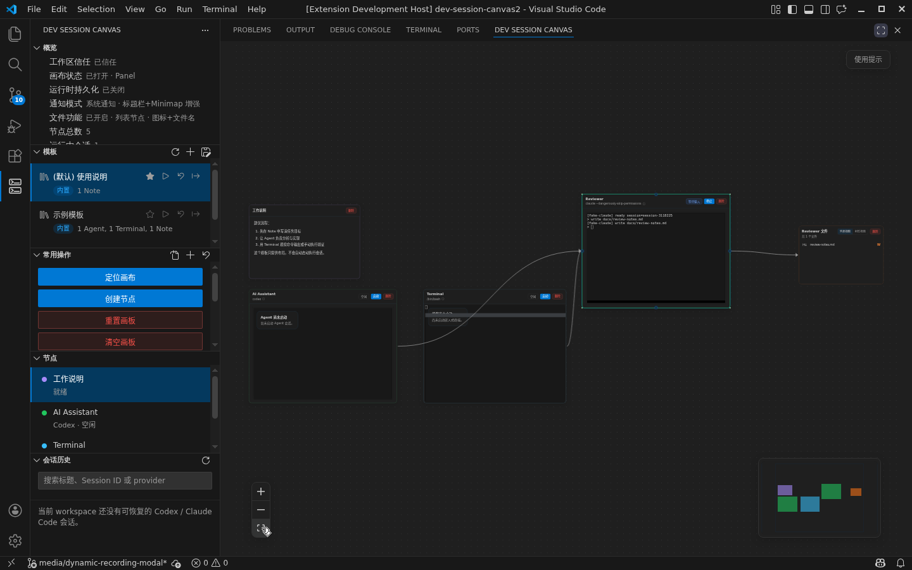

# Dev Session Canvas

<!-- dev-session-canvas-marketplace-readme -->

简体中文（默认） | [English](README.marketplace.en.md)

Dev Session Canvas 是运行在 VS Code 内的多 Agent 协作 AI 工作台，画布是这个工作台的主要交互载体。你可以把 `Agent`、`Terminal` 与 `Note` 节点放在同一视图中，同时管理多个开发执行会话，而不必在聊天面板、终端标签和编辑器之间来回切换。当前为公开 `Preview` 版本。



<video src="images/marketplace/canvas-overview.mp4" controls muted loop playsinline></video>

## 产品定位

- 它首先是 VS Code 内的 `AI workbench with canvas`，而不是一个只有 AI 点缀的可视化工具
- `Visualization` 对应的是交互载体：用画布承载多个执行对象与它们的全局关系
- `AI` 对应的是主要使用场景：面向多 Agent 协作开发，而不是单轮 chat-first 体验
- `Other` 对应的是工作台属性：强调它与 VS Code 原生编辑器、终端和插件生态协同工作

## 核心功能

- 在面板或编辑区打开主画布
- 创建 `Agent`、`Terminal` 与 `Note` 节点
- 通过 `codex` 或 `claude` CLI 驱动 `Agent` 节点执行
- 通过嵌入式终端运行 `Terminal` 节点
- 让 `Agent` 与嵌入式 `Terminal` 继承受控 shell 环境，并在诊断信息中暴露当前解析路径
- 在 `Note` 节点中使用 Markdown 预览、交互式 checklist、workspace 文件链接、代码块与公式
- 使用内置模板和自定义模板快速恢复一组 `Agent` / `Terminal` / `Note` 工作面
- `Restricted Mode` 下保留画布浏览，执行入口自动禁用
- 在 Linux 本地与 `Remote SSH` 的 `systemd --user` 可用时，`runtimePersistence.enabled` 提供更强的持久化保障；否则自动回退到 `best-effort`
- 在侧栏查看 `节点` 与 `会话历史` 列表，支持快速定位当前画布节点并从历史恢复新 `Agent` 节点

## 适用场景

- 受信任工作区，标准文件系统
- 已安装 `codex` 或 `claude` CLI
- 需要同时观察多个开发会话，而不想在终端标签间频繁切换
- 需要一个 canvas 形态的 AI 工作台，而不是单一聊天面板

## 支持范围与限制

- `Remote SSH` 主路径已验证可用，且仍是当前验证最充分的推荐环境
- Linux、macOS 本地工作区的 `Preview` 主路径已完成功能可用性验证
- Windows 本地工作区的 `Preview` 主路径已完成功能可用性验证；当前已知限制是使用 `Codex` 时执行节点内历史暂时无法向上翻页
- 侧栏 `会话历史` 只显示能明确确认属于当前 workspace 的记录；缺少工作目录信息的旧会话会被保守跳过
- `Restricted Mode` 允许打开画布，但禁用 `Agent` / `Terminal` 等执行入口
- `Virtual Workspace` 暂不支持
- 当前为 `Preview`，不提供稳定正式版承诺

## 环境要求

- VS Code `1.80.0` 或更高版本
- 标准文件系统工作区
- `Agent` 节点需要 Extension Host 可访问的 `codex` 或 `claude` CLI
- `Terminal` 节点需要工作区侧可用的 shell

## 0.8.0 版本亮点

当前公开的 `0.8.0` 版本聚焦 Agent 日常可用性：在画布执行节点中补齐熟悉的复制粘贴快捷键，提供 `Codex` / `Claude Code` CLI 配置入口，并让文件活动默认以更紧凑的列表节点呈现。

- `Agent` / `Terminal` 执行终端支持平台化复制粘贴快捷键：macOS 使用 `Cmd+C` / `Cmd+V`，Windows 支持有选区 `Ctrl+C` 复制和无选区 `Ctrl+C` 打断，Linux 使用 `Ctrl+Shift+C` / `Ctrl+Shift+V` 并保留 `Ctrl+C` 打断
- 粘贴链路带有多行安全确认：单行直接粘贴，bracketed paste mode 下直接粘贴，其他多行内容需要确认后才进入当前会话
- 侧栏和命令面板新增 `Codex` / `Claude Code` CLI 选择入口，便于把当前 workspace 绑定到实际可用的 provider 命令
- 命令面板可直接打开 `Codex config.toml`、`Codex auth.json` 和 `Claude Code settings.json`，并在缺失时创建受限权限的基础配置文件
- 文件活动功能开启时默认使用文件列表节点，更适合查看单个 Agent 或多个 Agent 共享的文件读写关系；仍可在设置中切回独立文件节点
- 修正模板重置复用节点身份、Claude onboarding 标记和代理地址占位等细节问题

## 安装与升级

- 扩展 ID 为 `devsessioncanvas.dev-session-canvas`
- 首次安装与从 `0.7.1` 升级到 `0.8.0` 都通过 `Visual Studio Marketplace` 获取；后续 `0.8.x` 更新同样通过 Marketplace 升级获取
- 若你此前显式设置过 `devSessionCanvas.notifications.attentionSignalBridge`，升级到 `0.8.0` 后会继续沿用该明确选择；默认安装路径仍优先使用 `system` 桥接并在必要时回退到工作台消息
- 若你在 `0.2.0` 中沿用了旧的 view layout 缓存，侧栏里的 `概览` 与 `常用操作` 可能暂时被拆成两个独立图标；这不表示重复安装了两个扩展，可手动把两个 view 移回同一 `Dev Session Canvas` 容器，或执行 `View: Reset View Locations` 恢复默认布局
- Preview 阶段不承诺跨版本工作区状态完全兼容；如工作区包含重要画布状态，建议升级前备份或在非关键环境验证

## 桌面通知 companion（自动安装）

- 安装 `Dev Session Canvas` 时，VS Code 会自动安装 `Dev Session Canvas Notifier`（`devsessioncanvas.dev-session-canvas-notifier`）
- 如果你是从 notifier 页面单独安装，VS Code 也会自动补齐主扩展 `Dev Session Canvas`
- 执行节点的 attention signal 默认会通过 `devSessionCanvas.notifications.attentionSignalBridge = system` 优先桥接到本机桌面；如需改回工作台消息或关闭桥接，可在主扩展设置中调整
- `system` 模式下，主扩展会优先把通知交给本机 UI 侧 companion；若 companion 缺失、当前平台不支持或投递失败，则自动回退到 VS Code 工作台消息
- 这个 companion 尤其适合 `Remote SSH`、WSL、Dev Container 等“主扩展跑在 workspace 侧、提醒需要回到本机桌面”的场景

## 使用提示

### Windows 环境下无法创建 Terminal 和 Agent 节点

**症状**：workspace 已信任，但创建节点时仍异常地只能看到 `Note` 类型，`Terminal` 和 `Agent` 节点类型不可见。

**排查方向**：若 workspace 已信任但仍出现该异常，可先检查 Windows PowerShell 执行策略；某些环境下，执行策略可能影响 Node.js 相关命令的正常执行。

**可尝试的处理方法**：

1. 以管理员身份打开 PowerShell
2. 运行以下命令设置执行策略为 `RemoteSigned`：
   ```powershell
   Set-ExecutionPolicy RemoteSigned
   ```
3. 输入 `Y` 确认更改
4. 关闭并重新打开 VS Code
5. 再次尝试创建 `Terminal` 或 `Agent` 节点，确认是否恢复正常

## 回退建议

- 若当前版本阻塞工作流，建议先禁用或卸载扩展
- 优先等待后续 `0.8.x` 修复版本，而非尝试手动降级
- 如需回退，请重新安装目标版本并验证工作区状态；Preview 版本之间不保证回退兼容
- 问题反馈、安全问题和支持边界说明见下方链接

## 支持与反馈

- Preview 支持边界：<https://github.com/ZY-WANG-0304/dev-session-canvas/blob/main/docs/support.md>
- 问题与功能反馈：<https://github.com/ZY-WANG-0304/dev-session-canvas/issues>
- 安全问题：`wzy0304@outlook.com`

## 开源信息

- License: `Apache-2.0`
- Repository: <https://github.com/ZY-WANG-0304/dev-session-canvas>
