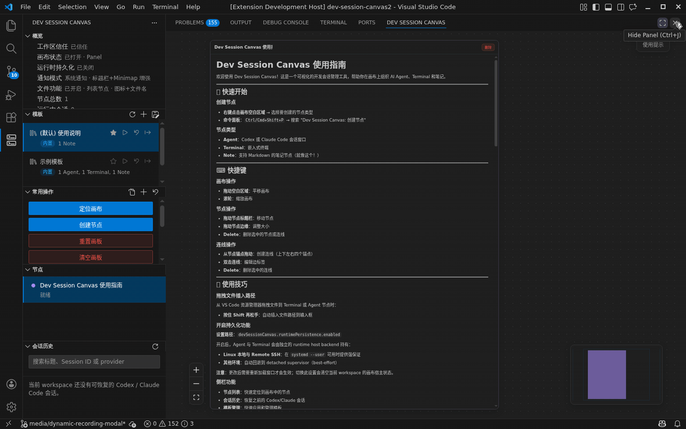

# DevSessionCanvas

English | [简体中文](README.zh-CN.md)

> **Temporary VS Code Marketplace notice / VS Code Marketplace 临时说明**: Due to an unknown VS Code Marketplace availability issue, this extension is temporarily unavailable there. You can download the VSIX from GitHub Releases and install it with `Extensions: Install from VSIX...`; Open VSX is not affected. / 由于未知原因，本扩展暂时无法在 VS Code Marketplace 上线；你可以从 GitHub Releases 下载 VSIX，并通过 `Extensions: Install from VSIX...` 安装；Open VSX 市场不受影响。

DevSessionCanvas is a multi-session collaboration canvas extension for VS Code. It provides a shared canvas that gives `Agent` and `Terminal` sessions a global view, helping you manage multiple development execution sessions inside a single workspace.

The product has entered the public `Preview` phase and already completed its first external release. Current work is focused on preparing the `0.15.2` Preview patch release and tightening follow-up `0.15.x` capabilities, release materials, and regression verification. It is aimed at advanced users who accept early limitations and can prepare their local CLI runtime environment themselves.



## Who It Is For

- Developers who need to run multiple `Agent` or terminal sessions in parallel inside the same VS Code workspace
- Users who want a canvas-level global context instead of switching back and forth between terminal tabs
- Advanced users who are willing to use a `Preview` build and can prepare `codex` or `claude` CLI themselves

## What The Preview Includes

- A primary canvas that defaults to the `panel` route and can also be switched back to the editor area
- A minimal working path for `Agent` and `Terminal` nodes
- Lightweight `Note` nodes for supporting collaboration
- Basic canvas interaction and layout built on React Flow
- Dynamic global overview zoom and configurable low-zoom overview rendering, so fit view can still show the full canvas when nodes are spread out
- `Note` nodes with Markdown syntax support
- `Note` nodes can be associated with `.md` / `.markdown` files in the workspace, with YAML metadata popovers and safe Markdown image previews
- Canvas templates with built-in default templates, custom template save / import / export, a template sidebar, reset entry points, and explicit save modes for associated Markdown Notes
- Canvas groups for naming, nesting, moving, resizing, and browsing related `Agent` / `Terminal` / `Note` nodes as larger work areas
- Multi-root workspace composition that shows each workspace folder as a system root section while preserving root-local canvas state
- Spatial fit view and MiniMap navigation that include nodes, user groups, and workspace-root sections
- Cross-platform shell-environment inheritance and diagnosable launch paths for `Agent` and embedded `Terminal` nodes
- File Explorer context-menu entries that create cwd-scoped `Terminal` or `Agent` nodes from workspace folders or files
- Execution-terminal copy / paste shortcuts that preserve platform-native copy, paste, and `Ctrl+C` interrupt semantics
- Execution-terminal link detection for native-style URLs, file paths, multiline line-number output, high-confidence TUI hard-wrapped URL / styled-file fragments, and live-output file-link cache refresh
- Sidebar and command-palette entry points for selecting `Codex` / `Claude Code` CLI commands, opening their config files, and separating stopped-node `New` versus `Restart` actions
- Claude Code Agent `Fork` from a trusted session id into a new Agent node that starts with provider-native fork semantics
- Automatic CLI selection / installation recovery when an `Agent` launch cannot resolve the requested CLI
- Multi-section desktop-notification companion sidebar with platform onboarding and `Codex` / `Claude Code` notification-configuration guidance
- Limited capability handling under `Restricted Mode`
- A public `Preview` release path targeting the `Visual Studio Marketplace` and `Open VSX`
- Sidebar `Nodes` and `Session History` lists that let users jump to canvas nodes and restore a new `Agent` node from history

## What The Preview Does Not Include

- A stable-release guarantee
- `Virtual Workspace` support
- A zero-configuration out-of-the-box experience for all users
- A stable-release-grade support commitment across all three desktop platforms
- A full stable-release delivery process

## Runtime Requirements

- VS Code `1.80.0` or later
- A standard filesystem workspace, either on local disk or in a `Remote SSH` workspace
- The required CLI runtime:
  - `Agent` nodes depend on `codex` or `claude`
  - `Terminal` nodes depend on a local shell
- A trusted workspace
  - In an untrusted workspace, the canvas can still be opened, but execution entry points are disabled

## Project Status

The project has completed its first round of research, design, and MVP validation, and is now in the public `Preview` phase. The current `0.15.2` release-prep focus is to ship a Preview patch for execution-node notification controls, Codex final-failure text reminders, Claude Agent `Ctrl-Z` containment, and canvas external-link opening controls. It preserves the `0.15.1` canvas navigation and multi-root reliability patch, the `0.15.0` Claude Code Agent Fork, owner-derived file-activity grouping, Panel Webview lifecycle diagnostics, publish-tag / GitHub Release assets automation, Marketplace metadata, installation topology, support boundaries, and Marketplace `Preview` positioning. The external version remains explicitly `Preview`, with no stable-release commitment.

Explicit conclusions:

- The current version is `Preview`, not a stable release.
- `Restricted Mode` is supported with limited capability messaging. Execution entry points such as `Agent` and `Terminal` are disabled in an untrusted workspace.
- `Virtual Workspace` is not supported. `vscode.dev`, GitHub Repositories, and other purely virtual filesystem windows are outside the release scope.
- The intended primary public distribution channel remains `Visual Studio Marketplace`, with `Open VSX` as a same-version supplemental channel; as of the `0.15.2` release-prep review on 2026-06-14, Open VSX is publicly visible but the Visual Studio Marketplace item pages still need to be restored / verified before final publish is treated as complete.
- The main path already has public `Preview` validation evidence across Linux, macOS, Windows local workspaces, and `Remote SSH`. The `0.15.2` repo-local validation focuses on version/package consistency, notification allow-list coverage, Codex final-failure text coverage, Claude Agent `Ctrl-Z` containment coverage, extension manifest checks, VSIX payload checks, and publish dry-run consistency; Windows still keeps one explicit known limitation: when using `Codex`, embedded session history cannot page upward yet.
- The product still depends on local CLI availability and workspace-extension runtime conditions, so it is better suited to advanced users who can prepare `codex` or `claude` CLI themselves.

Related entry points:

- Release playbook: [`docs/public-preview-release-playbook.md`](docs/public-preview-release-playbook.md)
- Public support boundaries: [`docs/support.md`](docs/support.md)
- Design conclusions and release judgment: [`docs/design-docs/public-marketplace-release-readiness.md`](docs/design-docs/public-marketplace-release-readiness.md)

## Preview Distribution

Public distribution is intended to happen through public extension registries. Official VS Code is still intended to use the `Visual Studio Marketplace` as the primary path, while `Open VSX` is the supplemental path for compatible hosts. During `0.15.2` release prep, Open VSX visibility is confirmed and Visual Studio Marketplace visibility remains a final-publish gate. GitHub Release assets are used as a release-day artifact mirror and manual-install fallback, not as a replacement for marketplace verification. `.vsix` files are otherwise kept as build artifacts and release-verification inputs rather than ordinary distribution files.

- Public `Preview` users should install through the extension registry configured by their host rather than by manually distributing a `.vsix`
- `Visual Studio Marketplace` remains the intended official VS Code installation path, but `0.15.2` final publish must first confirm that both the main extension and notifier are publicly visible there; later `0.15.x` updates still need the final git ref locked, the same version published to both `Visual Studio Marketplace` and `Open VSX`, and post-release verification completed
- `Open VSX` does not change the official VS Code Marketplace path and does not expand the compatibility-support matrix by itself

## Desktop Notification Companion (Auto-Installed)

Installing `Dev Session Canvas` automatically installs the companion extension `Dev Session Canvas Notifier` (`devsessioncanvas.dev-session-canvas-notifier`). If a user installs from the notifier page first, VS Code also auto-installs the main extension `Dev Session Canvas`.

- Execution-node attention signals now prefer the local desktop by default through `devSessionCanvas.notifications.attentionSignalBridge = system`; switch the setting if you want `workbench` or `none`, or narrow attention sources with `devSessionCanvas.notifications.enabledAttentionSignals`
- In `system` mode, the main extension prefers the local UI-side notifier companion and falls back to workbench notifications when the companion is missing, unsupported, or delivery fails
- The companion is especially useful in `Remote SSH`, WSL, and Dev Container scenarios where the main extension runs on the workspace side but the notification must return to the local desktop
- Notifier-specific release and verification guidance lives in [`docs/notifier-preview-release-playbook.md`](docs/notifier-preview-release-playbook.md)

## Build From Source And Install For Development

For developers, the recommended path is to build from source and install through an Extension Development Host, rather than manually installing a `.vsix`.

Minimum workflow:

```bash
npm install
npm run build
```

Then in the repository window:

1. Open `Run and Debug`
2. Select `Run Dev Session Canvas (Main Only)`
3. Press `F5` to launch the `Extension Development Host`

For more complete instructions on source development, `Remote SSH` debugging, and automated verification, see [CONTRIBUTING.md](CONTRIBUTING.md).

## Known Limitations

- The product is still in `Preview` and should not be treated as a stable production tool.
- `Virtual Workspace` is not supported.
- The public `Preview` distribution path is intended to consolidate around `Visual Studio Marketplace` with same-version `Open VSX` mirroring, but `0.15.2` final publish must first restore / verify Visual Studio Marketplace public visibility; release-day publication still requires manual execution and review.
- The `Remote SSH` main path is validated and usable, and it remains the most strongly validated recommended path. Linux, macOS, and Windows local main paths also have functional validation now, but Windows still has a known limitation where embedded `Codex` history cannot page upward.
- `Note` Markdown preview does not support raw HTML passthrough, arbitrary link schemes, file links outside the current workspace, directory targets, or rich-text block editing.
- Templates currently save static layout and configuration only; they do not save running sessions, terminal output, file activity, thumbnails, cloud sync, or template history.
- The first execution-terminal copy / paste shortcut release does not read custom user keybindings, and it does not cover Linux selection clipboard, right-click copyPaste, or HTML rich-text copying.
- The sidebar `Session History` list only shows `Codex` / `Claude Code` records that can be explicitly attributed to the current workspace; older sessions without working-directory metadata are skipped conservatively.
- If the machine does not have a usable `codex` or `claude` CLI, `Agent` nodes cannot provide the full experience.

## Support Matrix

| Scenario | Status | What Users Should Expect |
| --- | --- | --- |
| `Remote SSH` workspace | `Preview`, main path validated and best-validated | Users can try the main canvas, `Agent`, `Terminal`, and recovery flows; this remains the most recommended environment |
| Linux local workspace | `Preview`, main path validated | The local canvas, `Agent`, and `Terminal` main path already has Preview functional validation evidence |
| macOS local workspace | `Preview`, main path validated | The local canvas, `Agent`, and `Terminal` main path already has Preview functional validation evidence |
| Windows local workspace | `Preview`, main path validated with known limitation | The local canvas, `Agent`, and `Terminal` main path already has Preview functional validation evidence, but embedded `Codex` history still cannot page upward |
| `Restricted Mode` | Limited support | The canvas can be opened and saved layouts can be viewed, but execution entry points such as `Agent` and `Terminal` are disabled |
| `Virtual Workspace` | Unsupported | Outside the Preview scope |

## Capability Boundaries

- `Agent` nodes require `codex` or `claude` CLI that can be resolved by the local or remote Extension Host
- `Terminal` nodes require a shell environment available on the workspace side. macOS / Linux inherit a controlled shell env patch by default, while Windows lets the real shell run profile / AutoRun itself; `devSessionCanvas.terminal.inheritEnv` and `devSessionCanvas.terminal.shellArgs` provide explicit controls
- ordinary `Note` nodes keep raw Markdown text in canvas state as the authoritative body data; associated Markdown Notes use `.md` / `.markdown` files on disk as the authoritative source, and preview-mode links are limited to allowlisted external schemes and files inside the current workspace
- `devSessionCanvas.runtimePersistence.enabled = false`: baseline capability only, with no promise that real processes continue across VS Code lifecycle boundaries
- `devSessionCanvas.runtimePersistence.enabled = true`: now has substantial automation and manual validation evidence, especially around the `Remote SSH` real-reopen path. The user-visible guarantee still depends on the backend and platform combination. On Linux local and `Remote SSH`, the extension prefers a stronger guarantee when `systemd --user` is available, and otherwise falls back automatically to `best-effort`

## Feedback And Contact

- Scope, required environment details, and support boundaries before filing an issue: [`docs/support.md`](docs/support.md)
- Bugs and feature feedback: <https://github.com/ZY-WANG-0304/dev-session-canvas/issues>
- Security issues: `wzy0304@outlook.com`
- Feishu discussion group:

  

- WeChat discussion group:

  

## Development And Contribution

Development setup, local debugging, main-path verification, and commit conventions are documented in [CONTRIBUTING.md](CONTRIBUTING.md).

If you want to continue development, start with `docs/WORKFLOW.md`, `ARCHITECTURE.md`, and `docs/PRODUCT_SENSE.md`.

## Background And Motivation

The direct inspiration for this project came from [OpenCove](https://github.com/DeadWaveWave/opencove). Its approach of managing multiple development sessions on a single canvas was especially compelling. When several terminals are active at once, developers often have to jump back and forth between them just to understand the state and progress of each session.

This project started from the observation that day-to-day development already happens mostly inside VS Code, and that it would be valuable to bring a global multi-session view into that familiar editor workflow. At the time, there was no existing VS Code extension that felt close enough, so building one as an extension became the practical path.

The goal is not to recreate all of OpenCove inside VS Code. The point is to take inspiration from it, then narrow the product around the VS Code context: prioritize global visibility and management for `Agent` and `Terminal` sessions, work with the existing extension ecosystem, and improve the development experience for the AI era.
