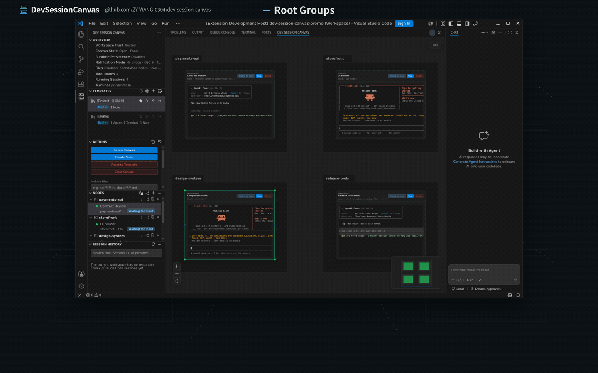

# DevSessionCanvas

简体中文 | [English](README.md)

> **VS Code Marketplace 临时说明**
>
> 由于未知的 Marketplace 可见性问题，DevSessionCanvas 暂时无法在 VS Code Marketplace 上线。
>
> - 可从 [GitHub Releases](https://github.com/ZY-WANG-0304/dev-session-canvas/releases) 下载 `.vsix`，再通过 `Extensions: Install from VSIX...` 安装。
> - Open VSX 市场不受影响。
>
> **Temporary VS Code Marketplace notice**
>
> DevSessionCanvas is temporarily unavailable on the VS Code Marketplace due to an unknown marketplace availability issue.
>
> - Install from [GitHub Releases](https://github.com/ZY-WANG-0304/dev-session-canvas/releases): download the `.vsix`, then run `Extensions: Install from VSIX...`.
> - Open VSX is not affected.

DevSessionCanvas 是一个面向 VS Code 的多会话协作画布扩展。它通过一张共享画布为 `Agent` 与 `Terminal` 提供全局视角，帮助你在同一个工作区里同时管理多个开发执行会话。

产品已进入公开 `Preview` 阶段；当前发布准备目标是 `0.24.1`，在发布准备分支完成 review、合并并正式发布之前，最新已发布基线仍是可通过 GitHub Release assets 与已验证 Open VSX 获取的 `0.24.0`。Visual Studio Marketplace 仍需等 public gallery 同时暴露主扩展与 notifier 后再解除 deferred。面向愿意接受早期限制、并能自行准备本地 CLI 运行环境的高级用户。



## 适合谁

- 需要在同一个 VS Code 工作区里并行运行多个 `Agent` 或终端会话的开发者
- 希望通过画布获得全局上下文，而非在终端标签之间来回切换的用户
- 愿意使用 `Preview` 版本，并能自行准备 `codex` 或 `claude` CLI 的高级用户

## Preview 提供什么

- 一张默认走 `panel` route、也可切回编辑区的主画布
- `Agent` 与 `Terminal` 节点的最小可运行链路
- `Note` 轻量辅助协作对象
- 基于 React Flow 的基础画布交互与布局
- 动态全局概览缩放与可配置低倍率概览，节点分散时仍可通过 fit view 看全完整画布
- 支持 Markdown 语法的 `Note` 节点
- `Note` 节点可关联 workspace 中的 `.md` / `.markdown` 文件，并支持 YAML metadata 浮层和安全 Markdown 图片预览
- 画布模板能力：内置默认模板、自定义模板保存 / 导入 / 导出、模板侧栏、重置入口，以及关联 Markdown Note 的显式保存策略
- 画布分组能力：可对相关 `Agent` / `Terminal` / `Note` 节点命名、嵌套、移动、调整尺寸，并在侧栏按分组浏览
- 多根 workspace 组合画布：每个 workspace folder 显示为带可选 root 名称水印的系统 root section，同时保留 root-local 画布状态
- 可选多根窗格画廊呈现：用动态 / 宫格全览和顶部 / 右侧缩略图模式巡检多个 root
- 空间级 fit view 与 MiniMap 导航：纳入节点、用户分组和 workspace-root section
- 画布右键菜单的一次性布局整理能力：尊重分组与 workspace root 边界，减少节点和分组重叠
- 画布右键菜单按当前普通分组、当前 workspace root 或整个 workspace 清空的受控入口，所有破坏性变更都先明确确认作用域
- `Agent` 与嵌入式 `Terminal` 的跨平台 shell 环境继承与可诊断启动路径
- File Explorer 右键入口，可从 workspace 内目录或文件创建绑定 cwd 的 `Terminal` 或 `Agent` 节点
- 执行终端复制粘贴快捷键，按本机平台保留复制、粘贴与 `Ctrl+C` 打断语义，并支持 live `Agent` 节点截图粘贴
- 执行终端链接识别覆盖原生风格 URL、文件路径、多行行号输出、高置信 TUI 硬换行 URL / 带样式文件片段、运行中输出的文件链接缓存刷新，以及点击时 fallback 搜索
- 当前输入节点优先、后台节点有界公平推进的无损输出调度，以及持久化执行会话的 Supervisor checkpoint + journal 权威恢复
- 侧栏与命令面板中的 `Codex` / `Claude Code` CLI 选择、配置文件打开入口，以及停止后节点的 `新建` / `恢复` 动作分流
- Codex / Claude Code Agent 可从可信 session id `分叉` 出新 Agent 节点，并用 provider 原生 fork 语义启动
- `Agent` 启动时 CLI 缺失的自动选择 / 安装补救入口
- 桌面通知 companion 的多 section sidebar、平台接入说明与 `Codex` / `Claude Code` 通知配置指引
- `Restricted Mode` 下的有限能力声明
- 面向 `Visual Studio Marketplace` 与 `Open VSX` 的公开 `Preview` 发布链路
- 侧栏中的 `节点` 与 `会话历史` 列表，可快速定位当前画布节点并从历史恢复或分叉新 `Agent` 节点
- 侧栏 workspace folder 操作：添加 folder、新建或添加 git worktree、区分 repository / linked worktree root，并通过显式确认移除 workspace folder 或 linked worktree
- 模板市场 Preview 流程：浏览模板、安装完整模板包、更新或回滚已安装的市场模板，并在 GitHub 认证可用时发布已保存的本地模板
- 产品自有 UI 文案默认英文，并为 VS Code 静态入口、Host 提示、侧栏和主画布 Webview 提供简体中文本地化

## Preview 不提供什么

- 稳定版承诺
- `Virtual Workspace` 支持
- 面向所有用户的零配置开箱体验
- 稳定版级别的三平台支持承诺
- 完整的稳定版发布链路

## 运行前提

- VS Code `1.80.0` 或更高版本
- 标准文件系统工作区（本地磁盘或 `Remote SSH` workspace）
- 对应的 CLI 运行环境：
  - `Agent` 节点依赖 `codex` 或 `claude`
  - `Terminal` 节点依赖本机 shell
- 受信任工作区
  - 未信任 workspace 下仍可打开画布，但执行型入口会被禁用

## 项目状态

项目已完成首轮研究、设计与 MVP 验证，处于公开 `Preview` 阶段。当前发布准备目标是 `0.24.1` 紧急修复：旧 Runtime Supervisor 托管的会话保持可交互，新会话立即进入隔离的当前 generation；在本发布准备分支完成 review、合并并正式发布前，最新已发布基线仍是 `0.24.0`。对外版本口径维持 `Preview`，不提供稳定正式版承诺。

明确结论：

- 版本定位为 `Preview`，尚未达到稳定正式版。
- 支持 `Restricted Mode` 有限能力声明；`Agent` / `Terminal` 等执行型入口在未信任 workspace 下会被禁用。
- 不支持 `Virtual Workspace`；`vscode.dev`、GitHub Repositories 等纯虚拟文件系统窗口不在发布范围内。
- 公开发布主渠道目标仍以 `Visual Studio Marketplace` 为主，`Open VSX` 作为同版本补充渠道；`0.24.1` release-day 完成门禁继续允许在 Visual Studio Marketplace 仍不可见时，依赖 GitHub Release assets 加已验证的 Open VSX 完成本轮发布，并把 VSM 记录为 deferred channel。
- Linux、macOS、Windows 本地工作区以及 `Remote SSH` 主路径已有公开 `Preview` 验证证据；`0.24.1` 发布准备分支负责完成版本 / 打包一致性、构建、审计、双 VSIX、旧 Supervisor 升级回归、packaged-payload smoke 与 publish dry-run 证据，最终 release-day 仍需在合并后的干净 `main` ref 上复核。Windows 下使用 `Codex` 时仍保留“执行节点内历史无法向上翻页”的已知限制。
- 仍依赖本地 CLI 和 workspace extension 运行条件，更适合愿意自行准备 `codex` / `claude` CLI 的高级用户。

相关入口：

- 发布执行手册：[`docs/public-preview-release-playbook.md`](docs/public-preview-release-playbook.md)
- 公开支持边界：[`docs/support.md`](docs/support.md)
- 设计结论与发布判断：[`docs/design-docs/public-marketplace-release-readiness.md`](docs/design-docs/public-marketplace-release-readiness.md)

## Preview 分发

对外分发目标是通过公开扩展市场发布；官方 VS Code 仍计划以 `Visual Studio Marketplace` 为主路径，`Open VSX` 作为 VS Code 兼容宿主的补充渠道。`0.24.1` 中，GitHub Release assets 继续作为 release-day 工件镜像和手动安装兜底入口，Open VSX 是当前必须验证通过的 marketplace 完成门禁；Visual Studio Marketplace 仍会尝试发布，但 public visibility 若仍不可用，则作为 deferred channel 记录而不阻塞本轮完成。除此之外，`.vsix` 仍仅保留为构建工件和发布验证输入。

- 公开 `Preview` 用户应通过当前宿主配置的扩展市场安装，而非手动分发 `.vsix`
- `Visual Studio Marketplace` 仍是官方 VS Code 安装主路径目标，但只有在主扩展和 notifier 均公开可见后才对外宣称可用；`0.24.1` 可在 VSM deferred 的状态下，通过 GitHub Release assets 加已验证的 Open VSX 完成本轮发布
- `Open VSX` 不改变当前 VS Code 官方市场主路径，也不额外承诺所有兼容宿主的完整支持矩阵

## 桌面通知 companion（自动安装）

安装 `Dev Session Canvas` 时，VS Code 会自动安装 companion 扩展 `Dev Session Canvas Notifier`（`devsessioncanvas.dev-session-canvas-notifier`）。如果你是从 notifier 页面单独安装，VS Code 也会自动补齐主扩展 `Dev Session Canvas`。

- 执行节点的 attention signal 默认会通过 `devSessionCanvas.notifications.attentionSignalBridge = system` 优先桥接到本机桌面；如需改回工作台消息、关闭桥接，或用 `devSessionCanvas.notifications.enabledAttentionSignals` 收窄可触发 attention 的信号源，可在主扩展设置中调整
- `system` 模式下会优先调用本机 UI 侧 notifier companion；若 companion 缺失、当前平台不支持或投递失败，则自动回退到工作台消息
- 该 companion 尤其适合 `Remote SSH`、WSL、Dev Container 等“主扩展运行在远端，而提醒需要回到本机桌面”的场景
- notifier 自己的发布与复核口径见 [`docs/notifier-preview-release-playbook.md`](docs/notifier-preview-release-playbook.md)

## 源码编译与开发安装

开发者推荐通过源码编译与 Development Host 方式安装和调试，而非手动安装 `.vsix`。

最小流程：

```bash
npm install
npm run build
```

然后在仓库窗口中：

1. 打开 `Run and Debug`
2. 选择 `Run Dev Session Canvas (Main Only)`
3. 按 `F5` 启动 `Extension Development Host`

更完整的源码开发、`Remote SSH` 调试和自动化验证说明见 [CONTRIBUTING.md](CONTRIBUTING.md)。

## 已知限制

- 仍处于 `Preview`，不应按稳定生产工具看待。
- 不支持 `Virtual Workspace`。
- 公开 `Preview` 的分发主路径目标仍是 `Visual Studio Marketplace`，并补充 `Open VSX` 同版本发布；`0.24.0` 已在 Visual Studio Marketplace 可见性 deferred 时依赖 GitHub Release assets 加 Open VSX verified 完成；`0.24.1` 沿用同一完成门禁，后续 release-day 仍需手工执行与复核。
- Runtime Supervisor journal 当前没有长期 retention / compact 策略或跨版本回退保证；local PTY 仍不能跨 Extension Host 生命周期继续运行，更强恢复只在 runtime persistence 及其后端可用时成立。
- 严格 90,000 行 completed terminal 压测已间歇性出现最终尾部未收齐，期间也有完整通过样本。在 PTY / bridge / journal / finalization 边界完成定位前，不能把单次极端大输出的最终尾部完整性写成已验证保证。
- 模板市场仍是 Preview 能力，可能需要访问 `https://dscanvas.dev`、在写操作中完成 GitHub 认证，并依赖通过市场发布流程或受控运维流程写入的生产目录数据。
- `Remote SSH` 主路径已验证可用，且仍是验证最充分的推荐路径；Linux、macOS、Windows 本地主路径也已完成功能可用性验证，但 Windows 下使用 `Codex` 时仍存在执行节点内历史无法向上翻页的已知问题。
- `Note` Markdown 预览不支持原始 HTML 透传、任意 scheme 链接、越出 workspace 的文件链接、目录目标或富文本块编辑。
- 模板当前只保存静态布局与配置，不保存运行中会话、终端输出、文件活动、缩略图、云同步或模板历史。
- 执行终端复制粘贴快捷键第一版不读取用户自定义 keybindings，也不覆盖 Linux selection clipboard、右键 copyPaste 或 HTML 富文本复制。
- 侧栏 `会话历史` 当前只显示可明确归属到当前 workspace 的 `Codex` / `Claude Code` 记录；缺少工作目录信息的旧会话会被保守跳过。
- 若本机没有可用的 `codex` 或 `claude` CLI，`Agent` 节点无法提供完整体验。

## 支持矩阵

| 场景 | 状态 | 用户可预期行为 |
| --- | --- | --- |
| `Remote SSH` workspace | `Preview`，主路径已验证且验证最充分 | 可体验画布、`Agent`、`Terminal` 和恢复等主路径；当前是最推荐环境 |
| Linux 本地 workspace | `Preview`，主路径已验证 | 本地工作区的画布、`Agent` 与 `Terminal` 主路径已有 Preview 功能可用性验证证据 |
| macOS 本地 workspace | `Preview`，主路径已验证 | 本地工作区的画布、`Agent` 与 `Terminal` 主路径已有 Preview 功能可用性验证证据 |
| Windows 本地 workspace | `Preview`，主路径已验证（含已知限制） | 本地工作区的画布、`Agent` 与 `Terminal` 主路径已有 Preview 功能可用性验证证据；使用 `Codex` 时执行节点内历史仍无法向上翻页 |
| `Restricted Mode` | 有限支持 | 可打开画布并查看已保存布局；`Agent` / `Terminal` 等执行型入口被禁用 |
| `Virtual Workspace` | 不支持 | 不在 Preview 范围内 |

## 能力边界

- `Agent` 节点：需要本机或远端 Extension Host 可解析的 `codex` 或 `claude` CLI
- `Terminal` 节点：需要工作区侧可用的 shell 环境；macOS / Linux 默认继承受控 shell env patch，Windows 让真实 shell 自己执行 profile / AutoRun，可通过 `devSessionCanvas.terminal.inheritEnv` 与 `devSessionCanvas.terminal.shellArgs` 调整
- `Note` 节点：普通 Note 的正文权威数据仍为画布内原始 Markdown 文本；关联 Markdown Note 以 `.md` / `.markdown` 磁盘文件为权威来源，预览态只允许安全白名单链接与当前 workspace 内文件目标
- `devSessionCanvas.runtimePersistence.enabled = false`：基线能力，不承诺真实进程跨 VS Code 生命周期持续存在
- `devSessionCanvas.runtimePersistence.enabled = true`：已具备较多自动化与人工验证证据，尤其覆盖 `Remote SSH` real-reopen 主路径；用户可见 guarantee 取决于 backend 与平台组合。Linux 本地与 `Remote SSH` 在 `systemd --user` 可用时优先尝试更强 guarantee，否则自动回退到 `best-effort`

## 反馈与交流

- 提 issue 前的适用范围、所需环境信息和受理边界：[`docs/support.md`](docs/support.md)
- 问题与功能反馈：<https://github.com/ZY-WANG-0304/dev-session-canvas/issues>
- 安全问题：`wzy0304@outlook.com`
- 飞书交流群：

  

- 微信交流群：

  

## 开发与贡献

开发环境准备、本地调试、主路径验证和提交约定，统一见 [CONTRIBUTING.md](CONTRIBUTING.md)。

如需继续推进开发，建议先阅读 `docs/WORKFLOW.md`、`ARCHITECTURE.md` 和 `docs/PRODUCT_SENSE.md`。

## 背景与动机

本项目的直接灵感来自 [OpenCove](https://github.com/DeadWaveWave/opencove)。它"在一张画布中管理多个开发会话"的方式很有启发性——当同时开启多个终端后，开发者往往需要在不同终端之间频繁切换，才能了解每个会话的状态与进度。

启动这个项目，是因为日常开发主要在 VS Code 中完成，希望把面向多开发会话的全局视角带到熟悉的编辑器工作流中。当时在 VS Code 插件生态里没有找到足够接近的现成方案，因此决定以扩展的形式自行实现。

项目目标不是在 VS Code 中复刻 OpenCove 的全部功能，而是吸收其产品启发，围绕 VS Code 场景做收敛：优先解决 `Agent` / `Terminal` 的全局可见性与管理问题，与现有插件生态配合，补足 AI 开发时代的体验。
