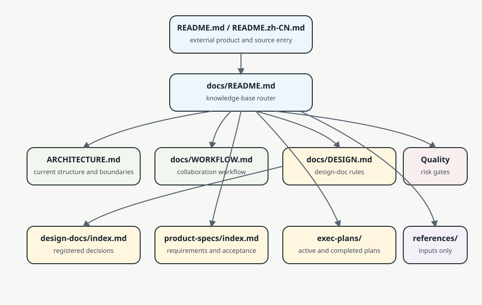

# 文档知识库入口

本页是仓库内正式文档的导航入口。它解释“去哪里找哪类结论”，不替代具体设计、产品规格、工作流或执行计划。

## 使用原则

- 先从根 `README.md` / `README.zh-CN.md` 理解产品定位、运行前提和外部分发状态。
- 需要当前系统边界、代码地图和依赖方向时，读根 `ARCHITECTURE.md`。
- 开始交付性工作或 Code Review 前，先读 `docs/WORKFLOW.md`，再按入口进入分支、提交、MR 或发布细分流程。
- 涉及设计决策、候选方案、取舍和验证证据时，读 `docs/DESIGN.md` 与 `docs/design-docs/index.md`，并把新结论登记到具体设计文档。
- 涉及需求范围、验收口径和产品限制时，读 `docs/product-specs/index.md`。
- 涉及复杂实现、显著重构或多步研究时，使用 `docs/exec-plans/active/` 中的 `ExecPlan` 推进，并在完成后按规则归档。

## 正式入口

- `ARCHITECTURE.md`：当前 monorepo 代码拓扑、运行时边界、架构不变量和常见改动入口。
- `docs/WORKFLOW.md`：交付、发布、服务部署和 Code Review 工作流总入口。
- `docs/DESIGN.md`：设计文档规范、frontmatter、状态枚举和索引同步规则。
- `docs/design-docs/index.md`：具体设计文档注册表，记录每份设计的状态、关联域和验证状态。
- `docs/product-specs/index.md`：产品规格入口，用于明确需求、范围和验收标准。
- `docs/exec-plans/active/`：正在执行或仍需继续推进的执行计划。
- `docs/exec-plans/completed/`：已完成计划的历史记录和验证证据。
- `docs/QUALITY_SCORE.md`、`docs/RELIABILITY.md`、`docs/SECURITY.md`：质量、可靠性和安全评估入口。

## 辅助目录边界

- `docs/diagrams/` 保存正式文档引用的图源和导出图；图只做导航增强，不能替代 Markdown 正文中的结论。
- `docs/references/` 只保存外部材料、官方文档摘录或调研输入，不能直接当作仓库正式结论。
- `docs/generated/` 若存在，只能作为自动生成输入或中间结果，不能替代人工确认后的文档。
- 扩展子目录下的 README / CHANGELOG 只解释局部安装、发布或变更，不复制根目录正式知识库。

## 当前 monorepo 文档口径

仓库根目录是 workspace、脚本和正式文档中心；主 VS Code 扩展位于 `extensions/vscode/dev-session-canvas/`，notifier companion 位于 `extensions/vscode/dev-session-canvas-notifier/`。所有产品、架构和设计结论仍回到根目录文档体系维护，避免每个子包形成互相冲突的“第二套真相”。
