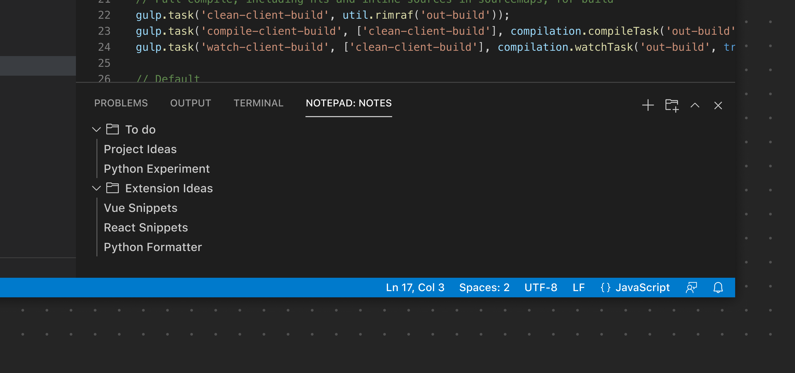
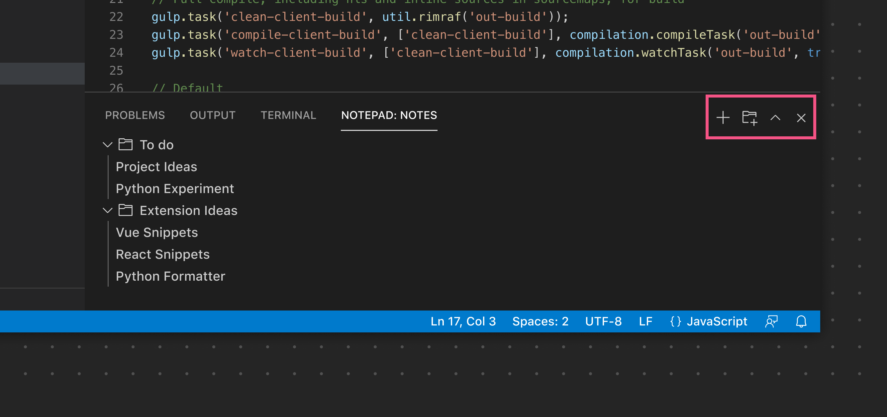
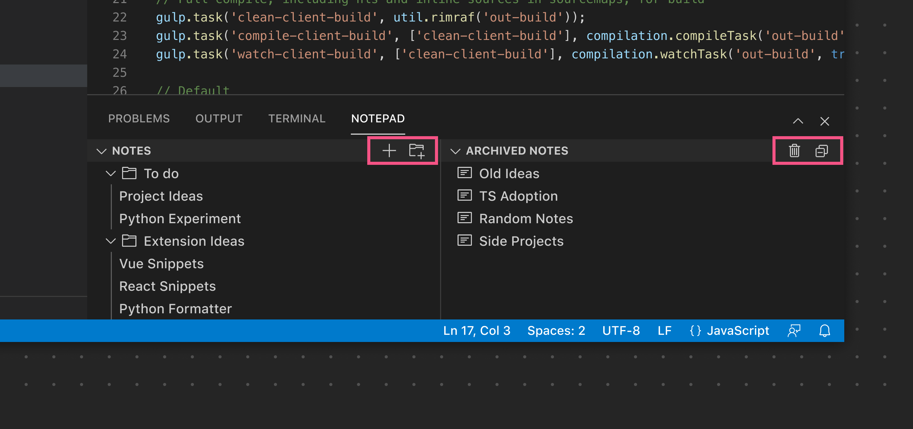

---
# DO NOT TOUCH — Managed by doc writer
ContentId: 06ce3b57-9fd5-428a-98aa-d730edbd2728
DateApproved: 4/15/2026

# Summarize the whole topic in less than 300 characters for SEO purpose
MetaDescription: UX guidelines for the Panel Bar in a Visual Studio Code extension.
---

# Panel

The Panel functions as another main area to display [View Containers](../references/contribution-points.md#contributes.viewsContainers).

**✔️ Do**

- Render Views in the Panel that benefit from more horizontal space
- Use for Views that provide supporting functionality

**❌ Don't**

- Use for Views that are meant to be always visible since users often minimize the Panel
- Render custom Webview content that fails to resize/reflow properly when dragged to other View Containers (like the Primary or Secondary Sidebars).

## Panel Toolbar

The Panel Toolbar can expose options scoped to the currently selected View. For example the Terminal view exposes [View Actions](../extension-guides/tree-view.md#view-actions) to add a new terminal, split the view layout, and more. Switching to the Problems view exposes a different set of actions. Similar to the [Sidebar Toolbar](sidebars.md#sidebar-toolbar), the toolbar will only render if there is just a single View. If more than one View is used, each View will render its own toolbar.

**✔️ Do**

- Use an existing [product icon](../references/icons-in-labels.md#icon-listing) if available
- Provide clear, useful tooltips

**❌ Don't**

- Don't add an excessive number of icon buttons. Consider using a [Context Menu](../references/contribution-points.md#contributes.menus) if more options are needed for a specific button.
- Don't duplicate the default Panel icons (collapse/expand, close, etc.)

*In this example, the single View rendered in the Panel renders its View Actions in the main Panel Toolbar.*

*In this example, multiple Views are used, so each View exposes its own specific View Actions.*

## Links

- [View Container contribution point](../references/contribution-points.md#contributes.viewsContainers)
- [View contribution point](../references/contribution-points.md#contributes.views)
- [View Actions extension guide](../extension-guides/tree-view.md#view-actions)
