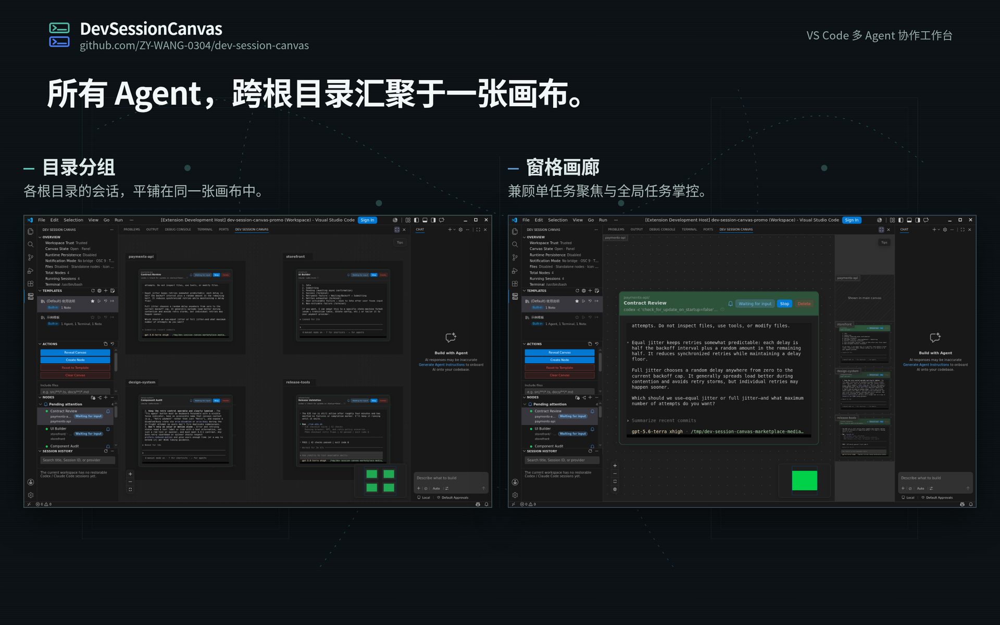

# Dev Session Canvas

<!-- dev-session-canvas-marketplace-readme -->

[English (default)](README.marketplace.md) | 简体中文

Dev Session Canvas 是运行在 VS Code 内的多 Agent 协作 AI 工作台，画布是这个工作台的主要交互载体。你可以把 `Agent`、`Terminal` 与 `Note` 节点放在同一视图中，同时管理多个开发执行会话，而不必在聊天面板、终端标签和编辑器之间来回切换。当前为公开 `Preview` 版本。



<video src="images/marketplace/canvas-overview.zh-CN.mp4" controls muted loop playsinline></video>

## 0.25.0 版本亮点

当前公开的 `0.25.0` 是相对 `0.24.5` 的新 `Preview` 里程碑。本版本有意回滚了 `0.24.5` release line 的部分 Runtime Supervisor 恢复、checkpoint 和输入调度能力，并在当前 release input 上重新实现 PTY title；不应把它理解为完整线性继承 `0.24.5` 的全部运行时承诺。

- Agent / Terminal 节点可以展示由 PTY 通过 OSC 0 / OSC 2 设置的动态标题，同时保留用户节点标题、Agent 启动命令、Terminal shell path 和 workspace context
- TUI 可以通过 `CSI 21 t` 查询当前标题，由实际 PTY owner 通过 `OSC l` 回写；标题控制序列和 payload 不进入终端可见输出、recent output、terminal stream、checkpoint 或 journal
- 标题 payload 会移除控制字符、折叠空白并限制长度；malformed 或未闭合 payload 采用 fail-closed 处理，避免可能的标题文本泄漏到持久化输出
- 标题只属于当前 live execution session，会话结束时清除；旧 execution session 的迟到 output、title 和终态消息不能覆盖新 session
- 主扩展与 `Dev Session Canvas Notifier` 继续保持同版本发布，本版本不新增用户设置，也不改变 notifier 投递行为
- 现有 Preview 画布、Agent / Terminal 生命周期、基础 journal / checkpoint、Fork、resize、multi-root 和 notifier 安装拓扑仍以最终发布 gate 结果为准

## 核心功能

- 在面板或编辑区打开主画布
- 创建 `Agent`、`Terminal` 与 `Note` 节点
- 通过 `codex` 或 `claude` CLI 驱动 `Agent` 节点执行
- 通过嵌入式终端运行 `Terminal` 节点
- 通过 VS Code 已注册编辑器打开识别出的文本和媒体文件链接，并为文本目标保留行列定位
- 拖动缩放 Agent / Terminal 节点时实时预览外框，只把稳定最终字符网格尺寸提交给底层 PTY
- 让 `Agent` 与嵌入式 `Terminal` 继承受控 shell 环境，并在诊断信息中暴露当前解析路径
- 可把支持的截图直接粘贴到 live `Agent` 节点中，以临时图片文件路径作为上下文，并保留用户手动提交提示词的节奏
- 通过 File Explorer 右键菜单，从 workspace 内目录或文件创建绑定 cwd 的 `Terminal` 或 `Agent` 节点
- 在 `Note` 节点中使用 Markdown 语法记录上下文
- 将 `Note` 节点关联到 workspace 中的 `.md` / `.markdown` 文件，并支持 YAML metadata 浮层和安全 Markdown 图片预览
- 使用内置模板和自定义模板快速恢复一组 `Agent` / `Terminal` / `Note` 工作面，并为关联 Markdown Note 提供显式保存策略
- 使用可命名画布分组组织相关 `Agent` / `Terminal` / `Note` 节点，支持嵌套分组、分组 resize 和侧栏分组树浏览
- 从持有可信 session id 的 Codex 或 Claude Code Agent `分叉` 出新 Agent 节点，用 provider 原生 fork 语义启动，并可为当前节点 Fork 配置向上 / 向下 / 向右落位
- 将 VS Code multi-root workspace 组合到同一张画布中，并用系统 workspace-root section 保留每个 root 自己的画布状态
- 可把多根 workspace 切到窗格画廊，用动态 / 宫格全览和顶部 / 右侧缩略图模式巡检多个 root
- 全局 fit view 与 MiniMap 会理解完整画布空间，包括节点、用户分组和 workspace-root section
- 可从右键菜单一次性整理画布布局，同时保留分组和 workspace root 边界
- 可从画布右键菜单清空当前普通分组、当前 workspace root 或整个 workspace，并在执行前明确确认作用域
- `Restricted Mode` 下保留画布浏览，执行入口自动禁用
- 在 Linux 本地与 `Remote SSH` 的 `systemd --user` 可用时，`runtimePersistence.enabled` 提供更强的持久化保障；否则自动回退到 `best-effort`
- 在 Agent / Terminal context row 展示 live PTY title，但不覆盖用户编辑的画布节点标题
- 在侧栏查看 `节点` 与 `会话历史` 列表，支持快速定位当前画布节点并从历史恢复或分叉新 `Agent` 节点
- 在侧栏 `节点` view 管理 workspace folder 和 git worktree，包括添加已有 worktree，并在移除 folder 或 linked worktree 前通过显式确认收口风险
- 浏览模板市场，把完整模板包安装到用户或 workspace 模板库，并更新或回滚已安装的市场模板
- 在 GitHub 认证和市场服务可用时，发布已保存的本地模板或提交市场模板新版本
- 根据 VS Code locale 使用英文默认 UI 或简体中文 UI，同时不翻译用户自有内容

## 适用场景

- 受信任工作区，标准文件系统
- 已安装 `codex` 或 `claude` CLI
- 需要同时观察多个开发会话，而不想在终端标签间频繁切换
- 需要一个 canvas 形态的 AI 工作台，而不是单一聊天面板
- 愿意试用 Preview 模板市场的用户；生产目录在真实模板发布前可能为空

## 支持范围与限制

- `Remote SSH` 主路径已验证可用，且仍是当前验证最充分的推荐环境
- Linux、macOS 本地工作区的 `Preview` 主路径已完成功能可用性验证
- Windows 本地工作区的 `Preview` 主路径已完成功能可用性验证；当前已知限制是使用 `Codex` 时执行节点内历史暂时无法向上翻页
- 真实旧二进制升级 smoke 当前覆盖 Linux / Unix socket；Windows named pipe 与 systemd generation 隔离只有路径级覆盖，不能视为完整跨平台真实升级矩阵
- 严格 90,000 行 completed terminal 压测已间歇性出现最终尾部未收齐，期间也有完整通过样本；单次极端大输出的最终尾部完整性仍在验证中
- journal compact 有意保持保守：不安全或过大的 checkpoint 会保留完整 journal，因此本版本不承诺固定磁盘上限、完整长期 retention 策略或跨版本 journal 回退兼容
- 相对 `0.24.5`，本版本不承诺后台恢复状态或进度通知、死亡 PTY 有界恢复、显式 Resume-only 启动、bounded checkpoint projection / 拒绝诊断，以及严格 FIFO 的单在途输入调度；Runtime Supervisor 行为仍受 Preview 与后端可用性约束
- Fork 定向落位已有自动化几何与交互覆盖，但 panel / editor 两种承载面的层间距与 `fork` 标签仍待最终人工视觉验收
- PNG 链接打开已有真实 VS Code Host 覆盖；GIF 与 MP4 走同一通用 opener 且 VS Code 已注册对应编辑器，但尚无各自的真实宿主 fixture。`vscode.open` resolve 只表示 editor service 已受理请求，不保证目标 model 最终加载成功
- resize 合并已有 Webview 回归与 trusted Host smoke，但仍待使用真实 Codex / Claude TUI 进程人工复核 journal；不同节点或跨 Pane Gallery surface 的多指触控不属于当前支持范围
- 侧栏 `会话历史` 只显示能明确确认属于当前 workspace 的记录；缺少工作目录信息的旧会话会被保守跳过
- `Restricted Mode` 允许打开画布，但禁用 `Agent` / `Terminal` 等执行入口
- `Virtual Workspace` 暂不支持
- 模板市场浏览和安装需要能访问当前配置的市场来源；发布、点赞、举报和管理员动作需要 GitHub 认证，并仍按 Preview 能力处理
- 当前为 `Preview`，不提供稳定正式版承诺

## 环境要求

- VS Code `1.80.0` 或更高版本
- 标准文件系统工作区
- `Agent` 节点需要 Extension Host 可访问的 `codex` 或 `claude` CLI
- `Terminal` 节点需要工作区侧可用的 shell

## 安装与升级

- 扩展 ID 为 `devsessioncanvas.dev-session-canvas`
- 首次安装与从 `0.24.5` 升级到 `0.25.0` 应通过当前宿主配置的公开扩展市场获取；Open VSX 兼容宿主路径应同步发布并验证同版本，也是当前 marketplace 完成门禁；官方 VS Code 的 `Visual Studio Marketplace` 路径只有在 release-day visibility check 确认主扩展与 notifier 均公开可见后才对外宣称可用。若 VSM 本轮仍为 deferred，GitHub Release assets 是手动安装兜底入口
- UI 语言跟随 VS Code locale。本版本不新增扩展自己的语言设置，也不会翻译用户内容、终端输出、provider 输出或市场模板数据
- Supervisor 支持的跨 Host 恢复仍取决于 `runtimePersistence.enabled` 与后端可用性。本版本不承诺 `0.24.5` 的后台恢复状态 / 进度、死亡 PTY 有界回放、bounded checkpoint projection 或严格 FIFO 输入行为；local PTY 不因此获得跨 Host 生命周期保证，Preview 版本之间也不承诺 runtime journal 的回退兼容
- 当前节点 Agent Fork 默认使用 `devSessionCanvas.canvas.forkPlacementDirection = up`；可改为 `down` 或 `right`，该设置只影响之后的当前节点 Fork，不重排既有 Fork 或会话历史入口的落位
- 生产模板市场可能以空目录启动。生产环境不会把代码内 seed 模板暴露为正式内容；真实模板必须通过发布流程或受控运维流程入库
- 窗格画廊只改变多根呈现；单根 workspace 继续显示普通画布，`rootGroups` 仍是默认多根模式和保守回退路径
- 布局整理是一次性显式操作，不提供撤销、不持续自动重排，也不跨普通分组或跨 root 搬移节点
- 若你此前显式设置过 `devSessionCanvas.runtimePersistence.enabled`、`devSessionCanvas.notifications.attentionSignalBridge`、`devSessionCanvas.notifications.enabledAttentionSignals`、`devSessionCanvas.notifications.strongTerminalAttentionReminder`、`devSessionCanvas.notifications.agentAbnormalOutputTextNotifications`、`devSessionCanvas.canvas.linkOpenMode`、`devSessionCanvas.canvas.workspaceRootWatermarks.enabled`、`devSessionCanvas.canvas.multiRootPresentationMode` 或 `devSessionCanvas.canvas.forkPlacementDirection`，升级到 `0.25.0` 后会继续沿用该明确选择
- 截图粘贴文件是扩展存储中的临时附件，不是 workspace 文件；它们会保留一段时间以便 Agent 上下文复用，之后由后台 TTL 维护任务清理
- 若你在 `0.2.0` 中沿用了旧的 view layout 缓存，侧栏里的 `概览` 与 `常用操作` 可能暂时被拆成两个独立图标；这不表示重复安装了两个扩展，可手动把两个 view 移回同一 `Dev Session Canvas` 容器，或执行 `View: Reset View Locations` 恢复默认布局
- Preview 阶段不承诺跨版本工作区状态完全兼容；如工作区包含重要画布状态，建议升级前备份或在非关键环境验证

## 桌面通知 companion（自动安装）

- 安装 `Dev Session Canvas` 时，VS Code 会自动安装 `Dev Session Canvas Notifier`（`devsessioncanvas.dev-session-canvas-notifier`）
- 如果你是从 notifier 页面单独安装，VS Code 也会自动补齐主扩展 `Dev Session Canvas`
- 执行节点的 attention signal 默认会通过 `devSessionCanvas.notifications.attentionSignalBridge = system` 优先桥接到本机桌面；如需改回工作台消息、关闭桥接，或用 `devSessionCanvas.notifications.enabledAttentionSignals` 收窄可触发 attention 的信号源，可在主扩展设置中调整
- `system` 模式下，主扩展会优先把通知交给本机 UI 侧 companion；若 companion 缺失、当前平台不支持或投递失败，则自动回退到 VS Code 工作台消息
- 这个 companion 尤其适合 `Remote SSH`、WSL、Dev Container 等“主扩展跑在 workspace 侧、提醒需要回到本机桌面”的场景

## 使用提示

### Windows 环境下无法创建 Terminal 和 Agent 节点

**症状**：workspace 已信任，但创建节点时仍异常地只能看到 `Note` 类型，`Terminal` 和 `Agent` 节点类型不可见。

**排查方向**：若 workspace 已信任但仍出现该异常，可先检查 Windows PowerShell 执行策略；某些环境下，执行策略可能影响 Node.js 相关命令的正常执行。

**可尝试的处理方法**：

1. 以管理员身份打开 PowerShell
2. 运行以下命令设置执行策略为 `RemoteSigned`：
   ```powershell
   Set-ExecutionPolicy RemoteSigned
   ```
3. 输入 `Y` 确认更改
4. 关闭并重新打开 VS Code
5. 再次尝试创建 `Terminal` 或 `Agent` 节点，确认是否恢复正常

## 回退建议

- 若当前版本阻塞工作流，建议先禁用或卸载扩展
- 优先等待后续更高的 `0.25.x` 修复版本，而非尝试手动降级；切换版本前先停止重要会话，因为 Supervisor journal 不承诺跨版本回退兼容
- 如需回退，请重新安装目标版本并验证工作区状态；Preview 版本之间不保证回退兼容
- 问题反馈、安全问题和支持边界说明见下方链接

## 支持与反馈

- Preview 支持边界：<https://github.com/ZY-WANG-0304/dev-session-canvas/blob/main/docs/support.md>
- 问题与功能反馈：<https://github.com/ZY-WANG-0304/dev-session-canvas/issues>
- 安全问题：`wzy0304@outlook.com`
## 开源信息

- License: `Apache-2.0`
- Repository: <https://github.com/ZY-WANG-0304/dev-session-canvas>
